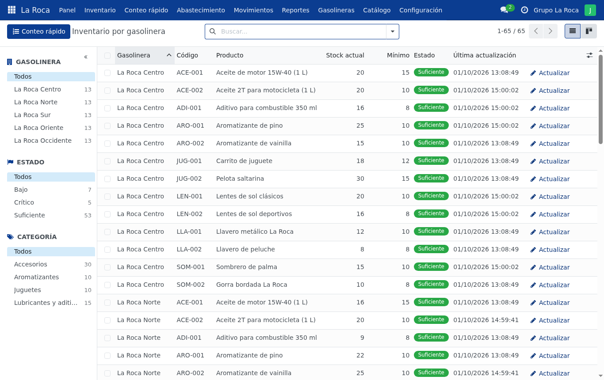

# Etapa 1 — La base del sistema

> **En pocas palabras:** se preparó el sistema para que cada persona entre con su usuario,
> se registraron las gasolineras y los productos, y cada encargado puede ver y anotar el
> inventario **solo de su gasolinera**.

## ¿Qué se puede hacer desde esta etapa?
- **Entrar con usuario y contraseña.** Hay dos tipos de usuario: *encargado de gasolinera* y *administrador*.
- **Registrar gasolineras** con su dirección, teléfono y encargados.
- **Tener un catálogo de productos** (lentes, llaveros, gorras, juguetes, aceites, aromatizantes…).
- **Ver el inventario de cada gasolinera**: qué producto hay y cuántas unidades.
- **Actualizar existencias**: el encargado anota cuánto tiene y el sistema guarda quién, cuándo y por qué.
  *(Actualización: en las mejoras se cambió. El encargado ya no corrige el stock a mano:
  **vende** y **pide productos**, y las correcciones las hace el administrador. Ver [Mejoras](MEJORAS.md).)*
- **Privacidad entre sucursales**: un encargado **no puede ver** otra gasolinera, aunque lo intente.

## ¿Para qué le sirve a Grupo La Roca?
Toda la información queda **en un solo lugar** en vez de repartida en chats de WhatsApp,
y cada cambio queda registrado (no se pierde ni se puede negar).

## ¿Cómo probarlo?
1. Entrá como **`encargado.centro`** (contraseña `LaRoca2026`).
2. Abrí **Inventario**: solo aparece *La Roca Centro*.
3. Tocá **Actualizar** en un producto, escribí otra cantidad y guardá.
4. Abrí el producto: abajo aparece el historial con tu cambio.
5. Salí y entrá como **`administrador`**: ahí se ven las 5 gasolineras.
6. En **Gasolineras → Nuevo**, creá una gasolinera: recibe automáticamente todos los productos.

## ¿Qué comprobamos?
- 12 pruebas automáticas (el sistema se prueba solo con un comando) y todas pasan.
- Probamos en el navegador con los dos tipos de usuario y en tamaño de celular.
- Un encargado que intenta abrir otra gasolinera recibe "acceso denegado".
- Los datos no se pierden al apagar y volver a encender.

## Actualizaciones posteriores
Varias cosas que en esta etapa quedaban pendientes ya se resolvieron después: las **fotos
de los productos**, el texto **"Usuario"** en la pantalla de inicio (antes decía "Correo
electrónico") y la revisión en tamaño de celular. Lo que sigue pendiente es la prueba en
un celular real y el correo para "Restablecer contraseña" (necesita un servidor de correo real).

## ¿Qué falta o hay que confirmar con la empresa?
- La cantidad real de gasolineras y la lista real de productos (se pueden cargar desde Excel).
- Si existe una **bodega central** desde donde salen los productos (el sistema lo supone).

---

## Anexo técnico (para el equipo de desarrollo)

> Esta parte usa términos técnicos: es para quien programa o explica el código en la defensa.
> Se escribió durante la etapa; algunos pendientes que figuran aquí ya se resolvieron
> (ver "Actualizaciones posteriores" y [Mejoras](MEJORAS.md)).

**Fecha:** 1 de octubre de 2026 · **Estado:** lista para revisión del equipo.

Alcance pedido: entorno con Docker, inicio de sesión, roles (administrador y encargado
de sucursal), registro de gasolineras, catálogo de productos e inventario por sucursal
con acceso limitado según el usuario.

---

### 1. Qué se hizo

#### Entorno
- `docker-compose.yml` con **PostgreSQL 16** y **Odoo 18 Community** (imágenes oficiales, arm64).
- Datos persistentes en volúmenes de Docker. Claves en `.env` (no se sube a GitHub).
- `config/odoo.conf`: una sola base (`laroca`), gestor web de bases desactivado
  (`list_db = False`), sin datos demo de Odoo.
- Idioma español (Latinoamérica), zona horaria America/El_Salvador, moneda USD.
- Registro público de cuentas desactivado: solo el administrador crea usuarios.

#### Decisiones de diseño (aprovechando Odoo)

| Necesidad | Solución | Por qué |
|---|---|---|
| Gasolinera | `stock.warehouse` nativo + campos propios (`laroca_*`) | Cada gasolinera obtiene sus ubicaciones, movimientos y transferencias de Odoo; las entregas de la etapa siguiente serán transferencias nativas desde la **Bodega Central**. |
| Catálogo | `product.template` nativo (productos "inventariables") | Ya trae código, categoría, precio, imagen, unidades. |
| Inventario por sucursal | Modelo propio `laroca.inventario`: una línea por (gasolinera, producto) | Muestra todos los productos aunque estén en cero y será la base del stock mínimo, estados y sugerencias. |
| Existencias reales | `stock.quant` nativo | El "stock actual" de cada línea se calcula sumando los quants de la gasolinera. |
| Actualizar stock | Asistente `laroca.actualizar.stock` → **ajuste de inventario nativo** | Cada cambio queda como movimiento (`stock.move`) con fecha, usuario y motivo: historial auditable. |
| Roles | Grupos `Encargado de sucursal` y `Administrador` (categoría "La Roca") | Se eligen en el formulario del usuario. |
| Acceso limitado | Reglas de registro (`ir.rule`) | El encargado solo ve líneas, gasolineras, ubicaciones, existencias y movimientos de **sus** gasolineras, también si escribe la URL a mano. |

#### Roles
- **Encargado de sucursal**: ve y actualiza el inventario de las gasolineras asignadas;
  ve el catálogo y sus gasolineras en solo lectura; no ve las apps nativas
  "Inventario" ni "Ajustes".
- **Administrador**: ve todas las gasolineras; crea y edita gasolineras, productos,
  categorías y usuarios; tiene además la app nativa "Inventario" para operaciones avanzadas.

#### Datos ficticios (`laroca_datos_prueba`)
Empresa "Grupo La Roca", **Bodega Central** + **5 gasolineras** (Centro, Norte, Sur,
Oriente, Occidente), **13 productos** en 4 categorías (lentes, llaveros, sombreros, gorras,
juguetes, aditivo, aceites, aromatizantes), 4 usuarios y existencias iniciales. Algunos
productos quedan intencionalmente con poco stock para probar las alertas de la Etapa 2.
Se cargan **solo al instalar** (`noupdate`), así que actualizar el módulo no pisa los cambios.

---

### 2. Dónde está el código

`src/addons/laroca_inventario/`

| Archivo | Contenido |
|---|---|
| `__manifest__.py` | Nombre, dependencias (`stock`) y archivos que carga el módulo |
| `models/laroca_inventario.py` | Modelo de inventario por gasolinera: stock actual, generación automática de líneas, historial |
| `models/stock_warehouse.py` | Campos de gasolinera (dirección, municipio, teléfono, encargados) |
| `models/stock_quant.py` | Cuando cambia una existencia nativa, actualiza el stock de la línea |
| `models/product.py` | Producto nuevo inventariable ⇒ se agrega a todas las gasolineras |
| `models/res_users.py` | Gasolineras asignadas al usuario |
| `wizard/actualizar_stock.py` | Asistente "Actualizar stock" (ajuste de inventario nativo) |
| `security/laroca_security.xml` | Roles y reglas de acceso por gasolinera |
| `security/ir.model.access.csv` | Permisos por modelo (leer/escribir/crear/borrar) |
| `data/laroca_data.xml` | Ajustes globales: varios almacenes, menús ocultos, sin registro público |
| `views/*.xml` | Pantallas: lista, kanban (móvil), detalle, búsqueda, gasolineras, catálogo, menús |
| `tests/test_inventario.py` | 12 pruebas automáticas |

`src/addons/laroca_datos_prueba/`: `data/*.xml` (empresa, gasolineras, productos, usuarios)
y `models/datos_prueba.py` (existencias iniciales).

---

### 3. Cómo probarlo

1. `./scripts/inicializar.sh` (solo la primera vez) y abrir http://localhost:8069.
2. **Encargado** — entrar como `encargado.centro`:
   - App **La Roca → Inventario**: solo aparece *La Roca Centro* (panel izquierdo).
   - Botón **Actualizar** en "Lentes de sol clásicos": poner `2`, motivo "Ventas / salidas" → Guardar.
     El stock cambia y se registra la fecha y el usuario.
   - Abrir la fila: el detalle muestra **Movimientos recientes** (carga inicial + tu ajuste).
   - Probar la vista **kanban** (ícono a la derecha de la barra de búsqueda); es la vista para teléfono.
   - Menú **Gasolineras** y **Catálogo**: solo lectura.
3. **Encargado con dos sucursales** — `encargado.sur`: ve Sur y Oriente.
4. **Administrador** — `administrador`:
   - Ve las 5 gasolineras en Inventario.
   - **Gasolineras → Nuevo**: crear una; al guardar recibe automáticamente todos los productos.
     Asignarle un encargado y comprobar con ese usuario que ahora la ve.
   - **Catálogo → Productos → Nuevo**: crear un producto (dejar "Rastrear inventario" activo);
     aparece en todas las gasolineras con stock 0.
   - **Configuración → Usuarios**: pestaña **La Roca** (gasolineras asignadas) y en
     "Permisos de acceso" la sección **La Roca** (rol).
5. **En el teléfono** (misma red Wi-Fi): abrir `http://<IP-de-la-Mac>:8069`.
6. **Pruebas automáticas**: `./scripts/pruebas.sh` (usa una base temporal).

---

### 4. Qué se probó y qué falta

#### Probado (1 de octubre de 2026)
**Automático** (`./scripts/pruebas.sh`, 12 pruebas, 0 fallos):
- Se crean líneas por cada gasolinera; la Bodega Central no lleva líneas.
- Producto nuevo inventariable ⇒ aparece en todas las gasolineras; un servicio no.
- Encargado: solo ve su gasolinera; leer una línea ajena da error de acceso.
- Asignar una gasolinera a un encargado le da acceso inmediato.
- Encargado no puede crear productos ni gasolineras.
- Actualizar stock: cambia la línea, coincide con el stock nativo de Odoo y crea movimientos.
- Encargado no puede actualizar otra gasolinera; no se aceptan cantidades negativas.
- Un movimiento nativo de Odoo actualiza la línea automáticamente.
- Archivar una gasolinera oculta sus líneas.

**Manual en navegador**:
- Inicio de sesión de encargado y administrador.
- Encargado: lista filtrada, asistente "Actualizar", detalle con historial, acceso
  denegado al abrir por URL un registro de otra gasolinera.
- Administrador: lista completa, alta de gasolinera con generación de líneas, catálogo.
- Verificación por RPC de menús y acciones para cada rol.
- Los datos se conservan tras actualizar el módulo y reiniciar los contenedores.
- Instalación desde cero (`docker compose down -v` + `./scripts/inicializar.sh`): ~25 s, sin errores.

#### Pendiente / limitaciones conocidas
- **No probado en un teléfono real.** Sí se probó con el navegador emulando un teléfono
  (375 px): Odoo muestra automáticamente la vista de tarjetas con filtros y botón "Actualizar".
- Productos sin imágenes (se muestra el ícono genérico).
- La página de login todavía dice "Correo electrónico" aunque el usuario es un nombre
  de usuario (texto nativo de Odoo).
- "Restablecer contraseña" necesita configurar un servidor de correo (no hecho).
- Despliegue en la nube pendiente (ver `DEPLOY.md`).

#### Próximas etapas (según la propuesta)
2. Stock mínimo por producto y gasolinera, estados **suficiente / bajo / crítico** y
   alertas automáticas.
3. Sugerencias de abastecimiento (cantidades a preparar por sucursal).
4. Entregas desde la Bodega Central (transferencias nativas) e historial de abastecimientos.
5. Panel general (pantalla 10.1 del documento) y reportes.
6. Despliegue en la nube, manual y pruebas integrales.

#### Para confirmar con la empresa
- Número real de gasolineras y lista real de productos.
- Si cada encargado puede tener varias gasolineras (ya soportado) y quién asigna los mínimos.
- Si existe una bodega central desde donde salen los productos (supuesto actual).
