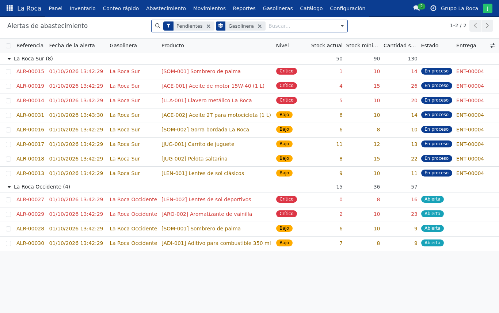
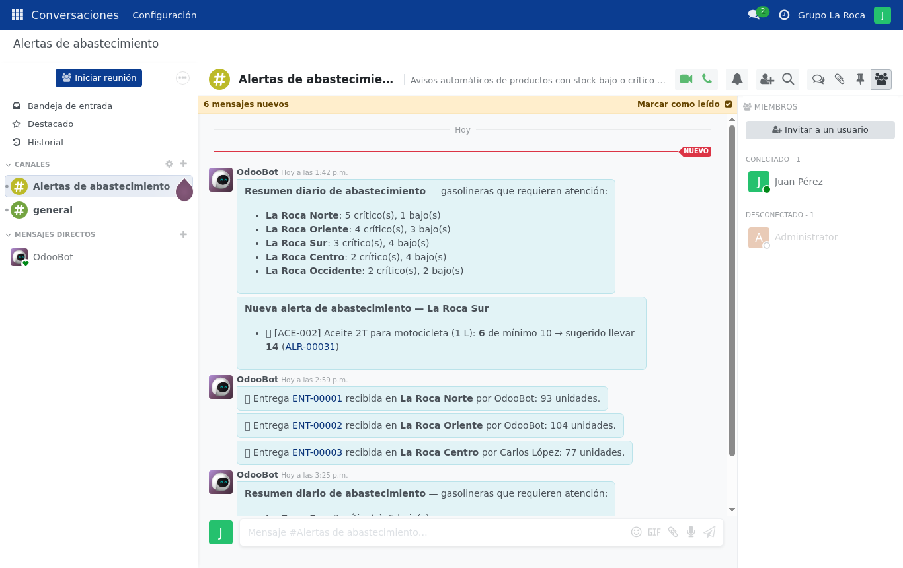

# Etapa 2 — Stock mínimo, colores y alertas automáticas

> **En pocas palabras:** cada producto tiene una **cantidad mínima** por gasolinera.
> Si baja de ese mínimo, el sistema lo marca en **naranja o rojo** y **avisa solo** al
> administrador, que ya no depende de un mensaje de WhatsApp.

## ¿Qué se puede hacer desde esta etapa?
- **Definir un mínimo** (por debajo, hay que reponer) y un **objetivo** (hasta cuánto reponer).
- **Ver el estado con colores**, como en el diseño del proyecto:

  | Color | Significa | Ejemplo con mínimo 10 |
  |---|---|---|
  | 🟢 Suficiente | Hay lo necesario | 10 o más |
  | 🟠 Bajo | Hay menos que el mínimo | de 6 a 9 |
  | 🔴 Crítico | Queda la mitad o menos | 5 o menos |

- **Alertas automáticas**: se crean solas, suben a "crítico" si empeora y se cierran solas
  cuando se repone el producto.
- **Avisos al administrador**: en el canal *Alertas de abastecimiento* del sistema, por
  correo, y un **resumen cada mañana** a las 7:00.
- **Sugerencias**: el sistema calcula **cuánto llevar** a cada gasolinera y cuánto hay en la bodega.

## ¿Para qué le sirve a Grupo La Roca?
El administrador sabe **qué falta, dónde y cuánto llevar** sin revisar mensajes uno por uno,
y las gasolineras más urgentes aparecen primero.

## ¿Cómo probarlo?
1. Entrá como **`encargado.centro`** → **Inventario**: verás las columnas *Mínimo* y *Estado* con colores.
2. Actualizá un producto verde a una cantidad menor que su mínimo: aparece el aviso "Stock bajo".
3. Entrá como **`administrador`**: tocá el globo de mensajes (arriba a la derecha) → canal
   *Alertas de abastecimiento*. Ahí está el aviso. También llegó un correo a <http://localhost:8025>.
4. **Abastecimiento → Sugerencias**: muestra cuánto llevar a cada gasolinera.
5. **Configuración → Parámetros**: podés cambiar a partir de qué porcentaje un producto es "crítico".

## ¿Qué comprobamos?
- 16 pruebas automáticas nuevas (28 en total en esa etapa), todas correctas: los colores
  coinciden con los ejemplos del diseño y las alertas se crean, suben de nivel y se cierran bien.
- Al pasar a esta versión no se perdió ningún dato.

## ¿Qué falta o hay que confirmar con la empresa?
- **Quién define los mínimos** (hoy solo el administrador) y qué porcentaje es "crítico" (hoy 50 %).
- Si los encargados también deben recibir avisos.
- Avisos por **WhatsApp**: no están incluidos.

---

## Anexo técnico (para el equipo de desarrollo)

> Esta parte usa términos técnicos: es para quien programa o explica el código en la defensa.
> Se escribió durante la etapa; algunos pendientes que figuran aquí ya se resolvieron
> (ver "Actualizaciones posteriores" y [Mejoras](MEJORAS.md)).

**Fecha:** 1 de octubre de 2026 · **Estado:** lista para revisión del equipo.

Cubre los pasos 2 a 5 del flujo propuesto (documento, sección 5) y el carril "Sistema"
del BPMN propuesto (Figura 2): comparar stock con el mínimo, marcar pendiente,
calcular cantidad sugerida, generar alerta y que el administrador consulte alertas y sugerencias.

---

### 1. Qué se hizo

#### Stock mínimo y objetivo
- Cada línea (gasolinera × producto) tiene **Stock mínimo** y **Stock objetivo**
  (hasta dónde se repone). El objetivo no puede ser menor que el mínimo.
- Cada producto tiene valores **por defecto** (pestaña "La Roca" en la ficha del producto)
  que se copian al agregarlo a una gasolinera. El botón **"Aplicar a todas las
  gasolineras"** los reemplaza en todas.
- El administrador edita los niveles en **Configuración → Stock mínimo por gasolinera**
  (lista editable; seleccionando varias filas se cambian todas a la vez).
- El encargado **no** puede cambiar mínimos (pendiente de confirmar con la empresa quién los define).

#### Estados (como en el mockup 10.2)

| Estado | Regla | Ejemplo con mínimo 10 y umbral 50 % |
|---|---|---|
| Suficiente | stock ≥ mínimo | 10, 12 |
| Bajo | stock < mínimo | 6, 7, 9 |
| Crítico | stock ≤ mínimo × umbral % | 0 a 5 |
| Sin mínimo | mínimo = 0 | (no se evalúa) |

El umbral crítico (por defecto 50 %) se cambia en **Configuración → Parámetros**.
La lista de inventario se colorea (rojo crítico, naranja bajo), ordena lo más urgente
primero y permite filtrar por estado desde el panel izquierdo.

#### Cantidad sugerida
`sugerida = objetivo − stock actual` (si no hay objetivo, se usa el doble del mínimo),
solo para productos bajos o críticos. La pantalla **Abastecimiento → Sugerencias** lista,
agrupado por gasolinera, qué y cuánto llevar, con el total por sucursal y lo
**disponible en la Bodega Central**.

#### Alertas automáticas
Modelo `laroca.alerta` (referencia ALR-00001…):
- **Se crea sola** cuando un producto queda bajo el mínimo, por cualquier vía: actualización
  del encargado, movimiento nativo de Odoo o cambio del mínimo.
- **Sube a crítico** si empeora (y se vuelve a notificar); no se duplica.
- **Se resuelve sola** cuando el stock vuelve a ser suficiente (queda en el historial).
- **Notificación** en el canal **"Alertas de abastecimiento"** de Conversaciones (Discuss),
  al que se suscriben automáticamente los administradores. Incluye producto, stock,
  mínimo, cantidad sugerida y enlace a la alerta.
- El encargado ve un **aviso en pantalla** al guardar si el producto quedó bajo/crítico,
  y puede consultar las alertas de sus gasolineras (solo lectura).
- **Tareas programadas** (Ajustes → Técnico → Acciones planificadas):
  - *Revisar alertas* cada hora (respaldo por si algún cambio no generó su alerta).
  - *Resumen diario* a las 7:00 a. m. con las gasolineras que requieren atención.

#### Gasolineras
La lista de gasolineras muestra cuántos productos críticos y bajos tiene cada una, y la
ficha tiene el botón **"Por abastecer"**: es la base del panel de la Etapa 4.

---

### 2. Dónde está el código

| Archivo | Contenido |
|---|---|
| `models/laroca_inventario.py` | Campos `stock_minimo`, `stock_objetivo`, `estado`, `cantidad_sugerida`, `disponible_bodega`; regla de estados (`_calcular_estado`) y `_sincronizar_alertas` |
| `models/laroca_alerta.py` | Modelo de alertas, mensajes al canal, tareas programadas |
| `models/res_company.py` | Parámetros: umbral crítico y bodega central |
| `models/product.py` | Niveles por defecto del producto y botón "Aplicar a todas" |
| `models/stock_warehouse.py` | Conteo de críticos/bajos por gasolinera |
| `wizard/actualizar_stock.py` | Aviso al encargado cuando el producto queda bajo/crítico |
| `data/laroca_alertas_data.xml` | Secuencia ALR-, canal de alertas, tareas programadas, bodega central |
| `views/abastecimiento_views.xml` | Alertas, Sugerencias, Stock mínimo, Parámetros, pestaña del producto |
| `tests/test_abastecimiento.py` | 16 pruebas de esta etapa |
| `laroca_datos_prueba/models/datos_prueba.py` | Mínimos y objetivos ficticios (`NIVELES`) |

---

### 3. Cómo probarlo

1. Aplicar cambios: tarea de VS Code **"Aplicar cambios del código"** o
   `./scripts/actualizar.sh laroca_inventario,laroca_datos_prueba` (no borra datos).
2. **Encargado** (`encargado.centro`): en Inventario aparecen Mínimo y Estado con colores.
   Usar el panel izquierdo "Estado → Crítico". Actualizar un producto *Suficiente*
   a un valor menor que su mínimo → aparece el aviso "Stock bajo".
3. **Administrador** (`administrador`):
   - Ícono de **Conversaciones** (globo arriba a la derecha) → canal
     *Alertas de abastecimiento*: está el mensaje de la alerta del paso 2, con enlace.
   - **Abastecimiento → Alertas**: alertas abiertas agrupadas por gasolinera.
   - **Abastecimiento → Sugerencias**: qué llevar a cada gasolinera y cuánto hay en bodega.
   - Volver a subir el stock del producto del paso 2 por encima del mínimo → la alerta pasa a *Resuelta*.
   - **Configuración → Parámetros**: cambiar el umbral a 70 % → más productos pasan a crítico.
   - **Configuración → Stock mínimo por gasolinera**: editar mínimos en la lista.
   - **Catálogo → Productos** → un producto → pestaña **La Roca**.
4. Pruebas automáticas: `./scripts/pruebas.sh` (28 pruebas en total).

---

### 4. Qué se probó y qué falta

#### Probado (1 de octubre de 2026)
**Automático** (28 pruebas, 0 fallos; 16 nuevas de esta etapa):
- Estados con los ejemplos del mockup (12/10 suficiente, 7/10 bajo, 4/10 crítico) y límites (10/10, 5/10).
- Sin mínimo, cantidad sugerida (con y sin objetivo), objetivo < mínimo rechazado.
- Umbral crítico configurable (recalcula estados y escala alertas) y validado (1–99 %).
- Encargado no puede cambiar mínimos; "Aplicar a todas las gasolineras".
- Ciclo completo de alerta: se crea, notifica, no duplica, escala a crítico, se resuelve.
- Un movimiento nativo de Odoo también genera alerta.
- Encargado ve solo alertas de sus gasolineras.
- Tarea programada de revisión y resumen diario; conteos por gasolinera; disponible en bodega.

**Sobre la base real (con RPC, igual que la interfaz)**:
- Actualización desde la Etapa 1 sin perder datos: 65 líneas con mínimos, 30 alertas
  iniciales y un único mensaje de resumen (no 30 mensajes).
- Encargado bajó "Aceite 2T" en La Roca Sur de 15 a 6 → aviso "Stock bajo", alerta
  ALR-00031 y mensaje en el canal (quedó así como ejemplo).
- El encargado no puede leer el canal de alertas ni abrir Parámetros.
- Todas las pantallas nuevas cargan para ambos roles.

#### No probado / pendiente
- **No se revisó visualmente en el navegador** esta etapa (el panel del navegador de la
  herramienta estaba oculto). Revisar especialmente colores, cintas "Crítico/Bajo" y el aviso.
- **Correo electrónico**: las alertas llegan por Conversaciones de Odoo, no por email
  (falta configurar un servidor de correo). WhatsApp no está integrado.
- Las alertas no se pueden cerrar a mano: se cierran al reponer el stock (decisión de diseño, revisable).
- Pendiente de confirmar con la empresa: quién define los mínimos, el umbral crítico real
  y si los encargados también deben recibir notificaciones.

#### Próximas etapas
3. **Entregas** desde la Bodega Central a partir de las sugerencias (transferencias nativas
   de Odoo), confirmación de entrega e historial de abastecimientos.
4. **Panel general** (mockup 10.1) y **reportes**.
5. Despliegue en la nube y pruebas integrales.
