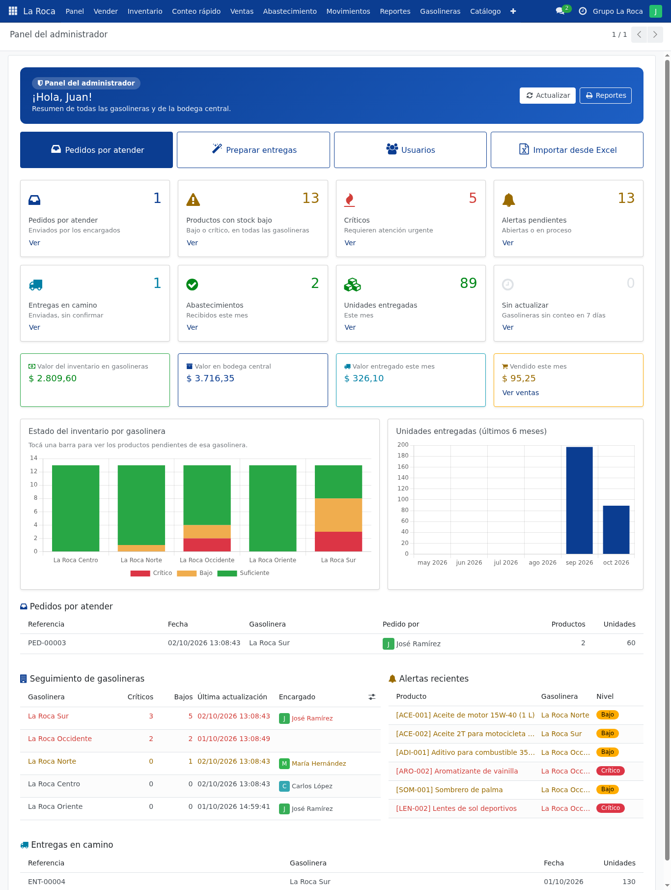
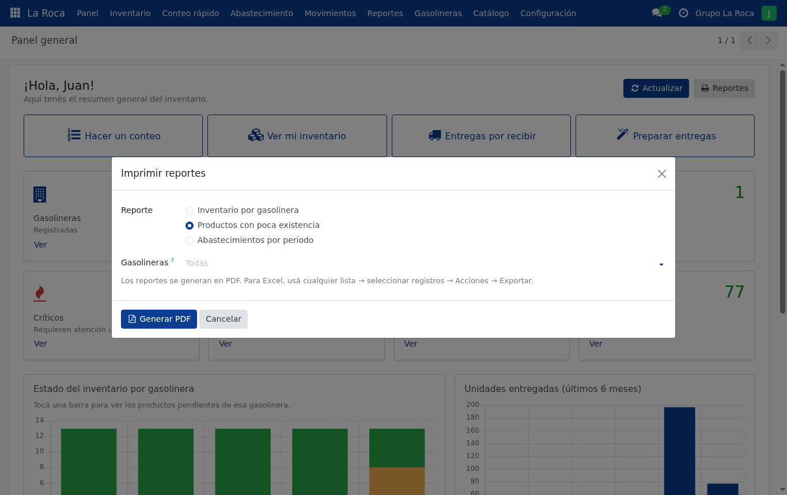

# Etapa 4 — Panel general y reportes

> **En pocas palabras:** al entrar se ve un **resumen con números y gráficos** del estado
> de todas las gasolineras, y se pueden sacar **reportes en PDF** para imprimir o compartir.

## ¿Qué se puede hacer desde esta etapa?
- **Panel general** (como el diseño del proyecto): "¡Hola, Juan!", tarjetas con los números
  importantes, gráficos, gasolineras que requieren atención y entregas en camino.
  Cada tarjeta tiene **Ver** para ir al detalle.
- **El encargado ve solo los datos de su gasolinera.** *(Actualización: después, en las
  mejoras, el encargado pasó a tener su propio panel más simple, "Mi gasolinera"; ver
  [Mejoras](MEJORAS.md).)*
- **Reportes en PDF** (menú *Reportes*):

  | Reporte | Sirve para |
  |---|---|
  | Inventario por gasolinera | Revisar todo y contar (trae una columna en blanco para anotar) |
  | Productos con poca existencia | Saber qué llevar y cuánto |
  | Abastecimientos por período | Ver qué se entregó en el mes |

- **Análisis con gráficos**: inventario, entregas y alertas, que se pueden agrupar como se quiera.
- **Exportar a Excel** cualquier lista.

## ¿Para qué le sirve a Grupo La Roca?
Permite **tomar decisiones con datos**: qué gasolineras atender primero, cuánto se
entregó en el mes y cuánto vale la mercadería.

## ¿Cómo probarlo?
1. Entrá como **`administrador`**: lo primero que se ve es el **Panel**.
2. Tocá **Ver** en las tarjetas y una barra del gráfico.
3. **Reportes → Imprimir reportes** → elegí un reporte → **Generar PDF**.
4. Entrá como **`encargado.sur`**: el panel solo muestra sus gasolineras.

Ejemplos de los PDF: [docs/ejemplos_reportes](ejemplos_reportes/).

## ¿Qué comprobamos?
- 8 pruebas automáticas nuevas (45 en total en esa etapa), todas correctas.
- Revisamos los PDF uno por uno; se corrigió un detalle de colores que no se veían.

## ¿Qué falta?
- Envío automático de reportes por correo (necesita un correo real).

---

## Anexo técnico (para el equipo de desarrollo)

> Esta parte usa términos técnicos: es para quien programa o explica el código en la defensa.
> Se escribió durante la etapa; algunos pendientes que figuran aquí ya se resolvieron
> (ver "Actualizaciones posteriores" y [Mejoras](MEJORAS.md)).

**Fecha:** 1 de octubre de 2026 · **Estado:** lista para revisión del equipo.

Cubre "mostrar un panel general y reportes básicos para apoyar la toma de decisiones"
(documento, sección 4), la pantalla 10.1 del mockup y el módulo "Historial y reportes"
(sección 9.4). También cubre el requisito "panel administrativo" y "reportes" de la rúbrica.

---

### 1. Qué se hizo

#### Panel general (mockup 10.1)
Es la **primera pantalla** al abrir la app *La Roca* (menú **Panel**):
- Saludo con el nombre del usuario ("¡Hola, Juan!"), como en el mockup.
- **8 tarjetas**, cada una con el botón *Ver* que abre el detalle:

| Tarjeta | Qué cuenta |
|---|---|
| Gasolineras | Registradas |
| Productos | Del catálogo |
| Productos con stock bajo | Líneas en estado bajo o crítico |
| Abastecimientos | Entregas recibidas este mes |
| Críticos | Líneas en estado crítico |
| Alertas pendientes | Abiertas o en proceso |
| Entregas en camino | Por recibir |
| Unidades entregadas | Este mes |

- **Gasolineras que requieren atención**: ordenadas por cantidad de críticos (las del
  mockup "La Roca Centro: 5 productos con stock crítico"); al tocar una se abre su ficha.
- **Entregas en camino**.
- Botón **Ver inventario completo**, como en el mockup.
- **Mismo panel, distinto alcance**: el encargado ve solo los números de sus gasolineras
  (se calculan con sus permisos).
- En el teléfono las tarjetas quedan de a dos por fila, como en el mockup.
- Hecho con vistas nativas de Odoo (formulario + Bootstrap): **sin JavaScript propio**.

#### Reportes en PDF (menú **Reportes → Imprimir reportes**)
Asistente donde se elige el reporte, las gasolineras (vacío = todas) y el período:

| Reporte | Contenido | Uso |
|---|---|---|
| Inventario por gasolinera | Todos los productos con stock, mínimo, estado y columna "Conteo físico" en blanco | Revisión general y hoja para contar |
| Productos con poca existencia | Solo bajos/críticos, cantidad sugerida, disponible en bodega y total a llevar | Preparar abastecimientos |
| Abastecimientos por período | Entregas recibidas, totales por gasolinera, productos más abastecidos y detalle | Seguimiento mensual |

Ejemplos generados con los datos ficticios: [`docs/ejemplos_reportes/`](ejemplos_reportes/).
El encargado solo obtiene reportes de sus gasolineras.

#### Análisis interactivos (gráficos y tablas dinámicas de Odoo)
- **Análisis de inventario**: gráfico de barras de estados por gasolinera y tabla dinámica.
- **Análisis de abastecimientos**: unidades entregadas por mes y gasolinera.
- **Análisis de alertas** (administrador): alertas por gasolinera, nivel y producto.

Cualquier lista se puede exportar a Excel con la función nativa de Odoo
(seleccionar → Acciones → Exportar).

---

### 2. Dónde está el código

| Archivo | Contenido |
|---|---|
| `models/laroca_panel.py` | Indicadores del panel y botones de navegación |
| `wizard/reporte.py` | Asistente de reportes y consultas de datos de cada reporte |
| `report/reporte_general.py` | Prepara los datos para la plantilla PDF |
| `report/reporte_general.xml` | Plantilla QWeb de los tres reportes |
| `views/panel_reportes_views.xml` | Pantalla del panel, asistente, gráficos y tablas dinámicas |
| `views/menus.xml` | Menús *Panel* y *Reportes* |
| `tests/test_panel_reportes.py` | 8 pruebas de esta etapa |

---

### 3. Cómo probarlo

1. Entrar como `administrador` → la app **La Roca** abre el **Panel**.
   Valores actuales con los datos ficticios: 5 gasolineras, 13 productos,
   12 con stock bajo, 1 abastecimiento este mes (ENT-00003) y 1 entrega en camino (ENT-00004).
2. Tocar *Ver* en cada tarjeta y una gasolinera de la lista de atención.
3. Entrar como `encargado.sur` → el panel muestra solo Sur y Oriente.
   Al recibir ENT-00004, volver al panel y pulsar **Actualizar**: cambian los números.
4. **Reportes → Imprimir reportes**: generar los tres PDF; probar con una sola gasolinera.
5. **Reportes → Análisis de inventario**: cambiar entre gráfico y tabla dinámica.
6. Probar el panel en el teléfono o achicando la ventana del navegador.

---

### 4. Qué se probó y qué falta

#### Probado (1 de octubre de 2026)
**Automático** (45 pruebas, 0 fallos; 8 nuevas):
- Indicadores del administrador coinciden con las consultas directas; orden de la lista de atención.
- Abastecimientos del mes: cuenta la entrega recibida y no una de hace 40 días.
- Panel del encargado limitado a su gasolinera; todos los botones abren su pantalla.
- Reportes: poca existencia (solo gasolineras con pendientes), inventario del encargado
  (no muestra otras gasolineras), abastecimientos dentro y fuera del período, fechas invertidas rechazadas.

**Sobre la base real**:
- Panel por RPC: administrador (5 / 13 / 12 / 1…) y `encargado.sur` (2 gasolineras, 8 pendientes).
- Los tres PDF generados con wkhtmltopdf y revisados visualmente.
- **Corregido:** las etiquetas de estado salían invisibles en el PDF (el motor de PDF no
  entiende los colores de Bootstrap 5); ahora usan colores fijos. Las entregas de ejemplo
  decían "Recibió: OdooBot"; ahora figura el encargado.

#### No probado / pendiente
- **Revisión visual del panel en el navegador** (el panel de la herramienta siguió oculto):
  revisar especialmente el aspecto de las tarjetas en computadora y teléfono.
- Gráficos dentro del panel: no se incluyeron para no agregar JavaScript propio; están en
  *Reportes → Análisis*. Si el equipo los quiere en el panel, se puede hacer con OWL (el
  framework de Odoo, no React).
- Envío automático de reportes por correo (requiere servidor de correo).

#### Próxima etapa
5. **Despliegue en la nube** (enlace público con HTTPS), manual de usuario, repositorio en
   GitHub con commits, pruebas integrales y preparación de la defensa (video demo).
