# Manual de usuario — Sistema de inventario y abastecimiento Grupo La Roca

Versión 1.0 · Octubre 2026 · Odoo 18 Community

Este manual explica cómo usar el sistema día a día. Está dividido por rol:
**Encargado de sucursal** (sección 2) y **Administrador** (sección 3).
Las imágenes usan datos ficticios de prueba.

---

## 1. Acceso al sistema

1. Abrir el navegador (computadora, tableta o teléfono) en la dirección del sistema.
   En la instalación local es **http://localhost:8069**.
2. En **Usuario** escribir tu nombre de usuario (por ejemplo `encargado.centro`) y en
   **Contraseña** tu clave.
3. Pulsar **Iniciar sesión**. Se abre la aplicación **La Roca** en el **Panel**. Cada rol tiene
   su propio panel: el encargado ve **Mi gasolinera** y el administrador el **Panel del administrador**.

| Rol | Puede |
|---|---|
| **Encargado de sucursal** | Ver el inventario **solo de sus gasolineras**, **vender** (el stock baja solo), **pedir productos** al administrador, ver sus alertas y confirmar la recepción de entregas. **No corrige el stock a mano** ni modifica un pedido ya enviado. |
| **Administrador** | Todo lo anterior en **todas** las gasolineras, más: atender pedidos, crear entregas, hacer conteos y corregir existencias, anular ventas, gestionar gasolineras, productos, mínimos, usuarios, parámetros, reportes e importaciones. |

> ¿Olvidaste tu contraseña? Pedile al administrador que la cambie
> (La Roca → Configuración → Usuarios → el usuario → *Cambiar contraseña*).

### Menú principal

| Menú | Para qué sirve |
|---|---|
| **Panel** | Tu pantalla de inicio: *Mi gasolinera* (encargado) o *Panel del administrador*. |
| **Vender** | Registrar lo que se vendió; el inventario se descuenta solo. |
| **Inventario** | Existencias de cada producto por gasolinera. |
| **Conteo rápido** | Solo administrador: corregir muchos productos a la vez después de contar. |
| **Ventas** | Ventas registradas (cada encargado ve las de su gasolinera). |
| **Abastecimiento** | Pedidos, alertas, sugerencias, entregas e historial. |
| **Movimientos** | Todos los cambios de stock (quién, cuándo, cuánto). |
| **Reportes** | PDF y análisis con gráficos (inventario, abastecimientos, alertas y ventas). |
| **Gasolineras / Catálogo** | Datos de las sucursales y de los productos. |
| **Configuración** | Solo administrador: mínimos, parámetros, importación y usuarios. |

### Cerrar sesión
Menú de tu nombre (arriba a la derecha) → **Cerrar sesión**: aparece una alerta para confirmar
(*Sí, cerrar sesión* / *Cancelar*).

### Buscar y filtrar
- **A la izquierda** de todas las listas y análisis (Inventario, Sugerencias, Entregas, Historial,
  Pedidos, Ventas, Alertas, Productos y Reportes) están las opciones simples: **Estado**,
  **Gasolinera** y **Categoría**, según la pantalla. Un toque filtra;
  **Todos** quita el filtro. En el teléfono aparecen como botones arriba de la lista.
- En el **buscador** se escribe un nombre (producto, referencia…). Las pantallas abren sin filtros
  puestos; si agregás uno desde el menú ▾, se ve como etiqueta y se quita con la **✕**.

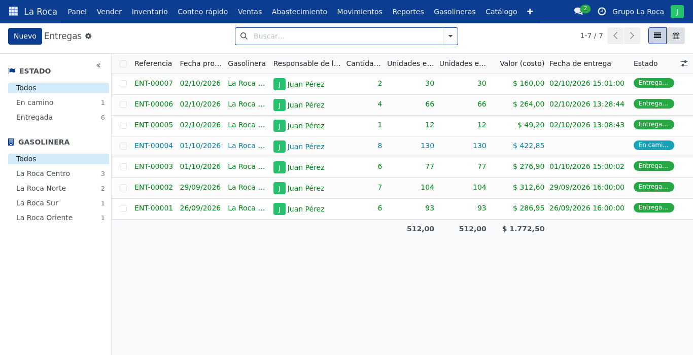

---

## 2. Encargado de sucursal

### 2.1 Mi gasolinera (tu panel)
Es una pantalla pensada para el día a día del encargado:
- **Encabezado verde** con el nombre de tu(s) gasolinera(s) y cuándo se actualizó el inventario por última vez.
- **¿Qué querés hacer?**: cuatro botones grandes: **Vender**, **Pedir productos**,
  *Recibir entregas* y *Ver mi inventario*. Debajo, accesos a *Mis pedidos*, *Mis ventas* y *Mis alertas*.
- **Así está tu inventario**: cuántos productos están 🟢 suficientes, 🟠 bajos y 🔴 críticos,
  y cuánto **vendiste hoy**. **Ver** abre el detalle.
- **Productos que se están acabando**: la lista con foto, cuánto hay y el mínimo, con el botón
  **Pedir estos productos**, que arma un pedido con las cantidades sugeridas.
- **Entregas por recibir**, **Mis pedidos** y dos gráficos: el estado de tus productos (tocá un
  color para verlos) y las unidades recibidas por mes.

Pulsá **Actualizar** para recalcular.

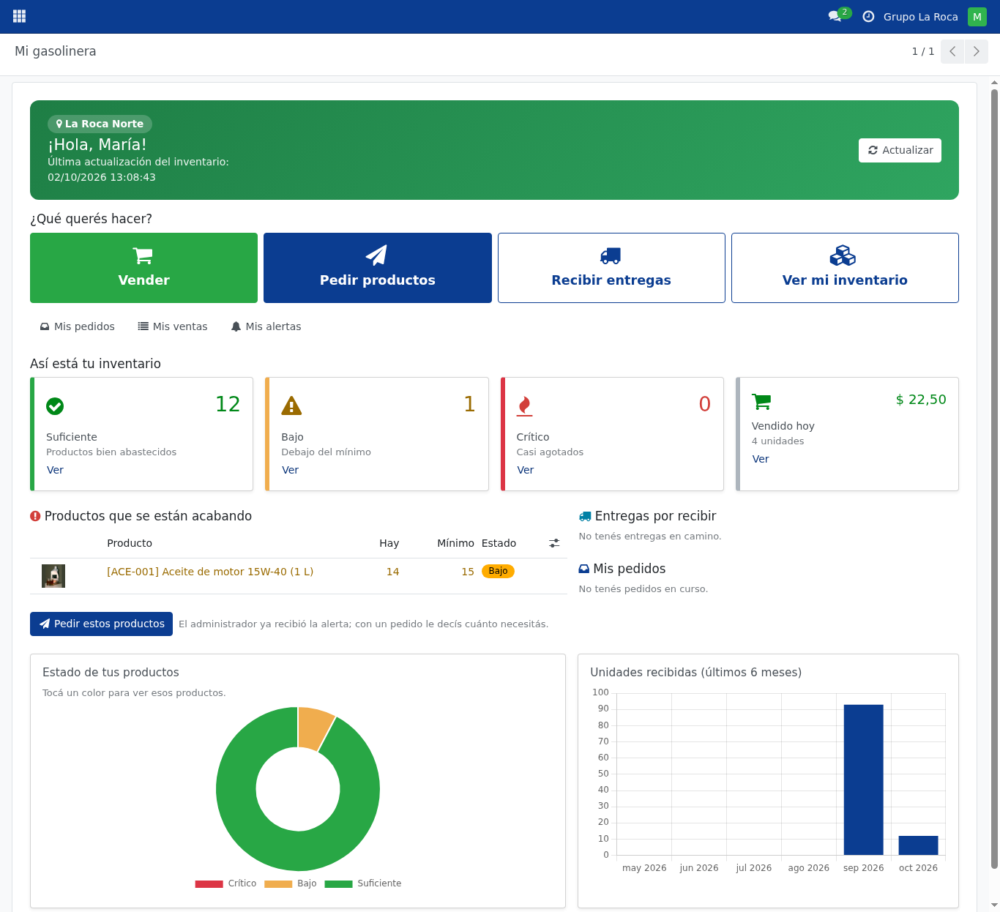

### 2.2 Consultar el inventario
**Inventario** muestra cada producto con **stock actual**, **mínimo** y **estado**:

| Estado | Significa |
|---|---|
| 🟢 **Suficiente** | Hay igual o más que el mínimo. |
| 🟠 **Bajo** | Hay menos que el mínimo. |
| 🔴 **Crítico** | Hay la mitad del mínimo o menos (el porcentaje lo define el administrador). |

- La columna **En bodega** muestra cuánto hay disponible en la **bodega central** para
  mandarte (también en *Pedir productos* y en **Abastecimiento → Bodega central**).
- A la izquierda (o arriba en el teléfono) se filtra por **gasolinera, estado y categoría**.
- Los productos más urgentes aparecen primero.
- En el teléfono se ve en tarjetas con foto.

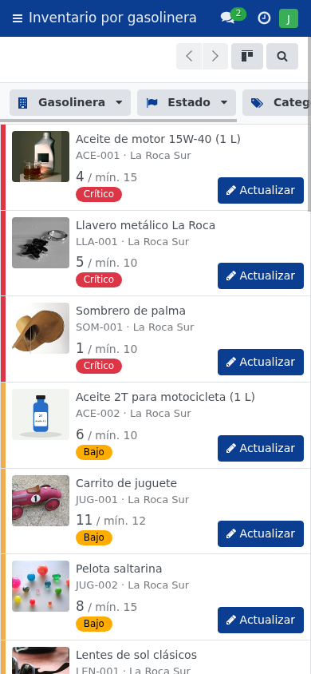

Al tocar un producto se abre su **detalle** con los **movimientos recientes**
(entradas en verde, salidas en rojo):

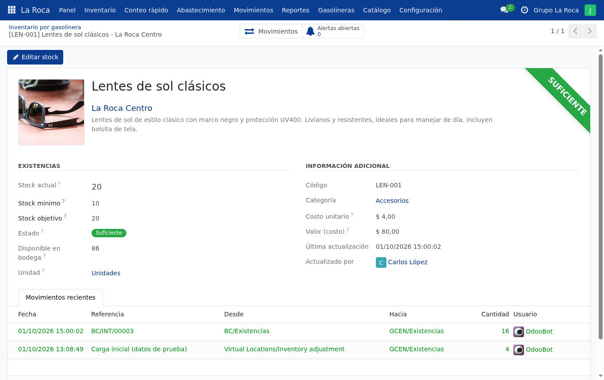

### 2.3 Vender
Cada vez que vendés algo, registralo para que el inventario se descuente solo.
1. Botón verde **Vender** del panel (o menú **Vender**).
2. Aparecen los productos que tenés, con su **precio** y cuántos **hay**. Podés **buscar**
   por nombre (por ejemplo "llavero") o filtrar por categoría.
3. En **Vender** usá los botones **−** y **+** (o escribí el número). Al instante ves cuántos
   **Quedan** (por ejemplo: hay 20, vendés 5, quedan 15) y abajo el **Total a cobrar**. En el
   teléfono, tocá el producto y usá − y +.
   - Si llegás a lo último que hay, el renglón dice **"¡Ya no hay más!"**.
   - Si escribís (o sumás con **+**) más de lo que hay, aparece la alerta **"¡No hay más stock!"**
     y la cantidad queda en lo máximo que hay.

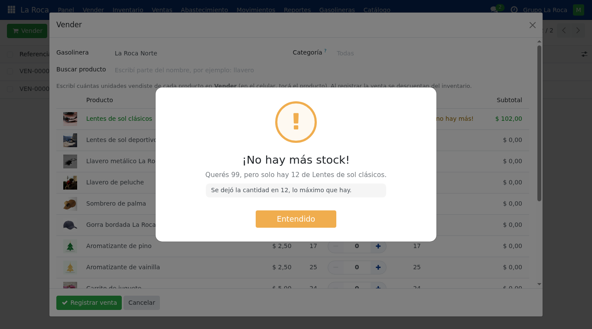
4. **Registrar venta**. Aparece una alerta verde **"¡Venta registrada!"** con el número
   (VEN-00001…), las unidades y el total. El stock baja y la venta queda en **Ventas**.

- **No se puede vender más de lo que hay.** Si lo intentás, aparece una alerta roja
  **"Stock insuficiente"** que dice cuánto hay; la pantalla queda abierta para corregir la
  cantidad (en el teléfono, la cantidad se pone en rojo).
- Si un producto queda por debajo del mínimo, el aviso te lo dice y **el administrador recibe
  una alerta automáticamente**.
- Una venta **no se modifica**. Si te equivocaste, avisale al administrador: él la **anula** y
  los productos vuelven al inventario.

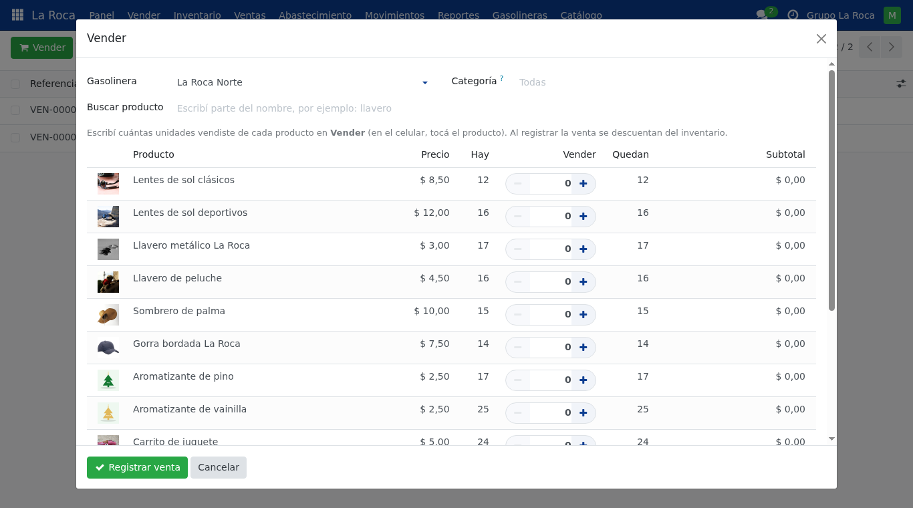

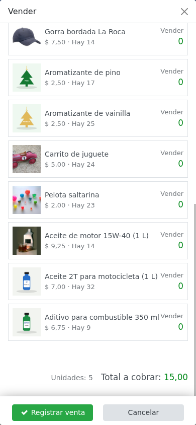

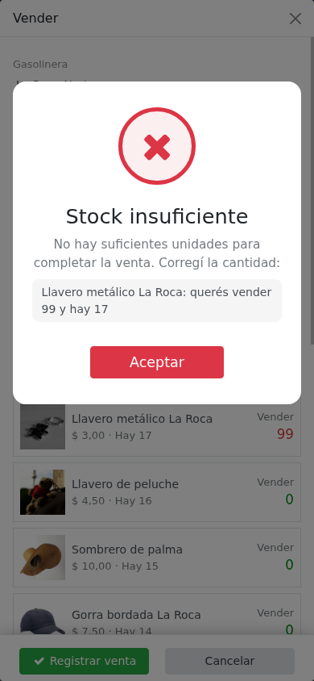

### 2.4 Pedir productos al administrador
Cuando necesitás mercadería (por ejemplo, **50 llaveros**), es una sola pantalla:
1. Botón **Pedir productos** del panel (o **Abastecimiento → Pedidos → Pedir productos**).
2. Aparecen todos tus productos, **primero los que más faltan**, con cuánto **tenés**, el
   **mínimo** y lo **sugerido**. Para decir cuánto pedís:
   - **−** y **+** en **Pido** (o escribí el número);
   - tocá el número **Sugerido** de un producto y se copia en Pido;
   - o encendé el interruptor **Completar con lo sugerido**: llena al instante todos los
     productos que faltan (al apagarlo, vuelven a 0).
3. Si querés, un **comentario** ("para el fin de semana largo").
4. **Enviar pedido**. Aparece la alerta verde **"¡Tu pedido se realizó!"** con el número y lo
   que pediste. El administrador recibe el aviso en el sistema y por correo.

Desde el panel, **Pedir estos productos** abre la misma pantalla con lo que se está acabando
ya completado: solo falta tocar **Enviar pedido**.

Después del envío **el pedido ya no se puede modificar**; si necesitás más, hacé otro pedido.
Su estado te dice en qué va: *Enviado* → *En preparación* → *En camino* → *Entregado*
(o *Rechazado*, con el motivo). Cada cambio te llega como notificación.

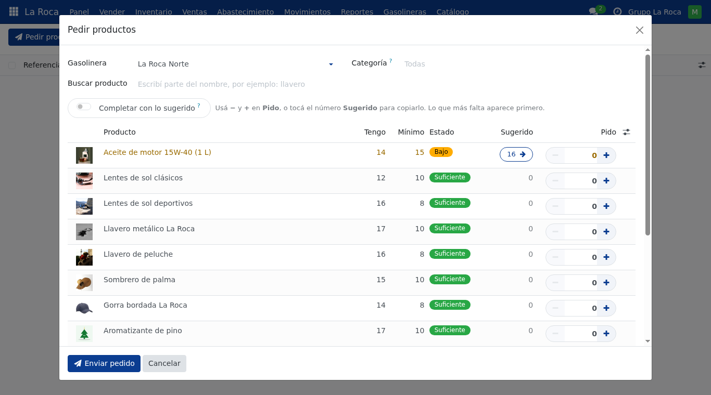

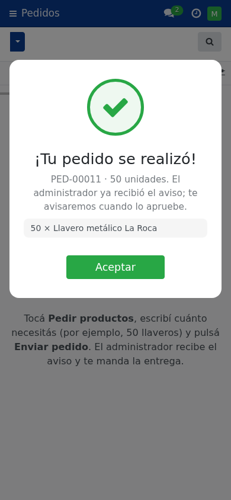

### 2.5 Recibir una entrega
Cuando el administrador envía productos (por un pedido o por su cuenta), te llega un aviso y la
entrega aparece **En camino** en tu panel (*Entregas por recibir*) y en **Abastecimiento → Entregas**.
- Si llegó **todo**, tocá **Entregado ✓** (en la lista o en la entrega) y confirmá. Tu inventario se
  actualiza solo y el pedido queda *Entregado*. El administrador también puede marcarla.
- Si llegó **distinto** (faltó algo), abrí la entrega y usá **Llegó distinto (corregir)** para escribir
  lo que realmente recibiste.

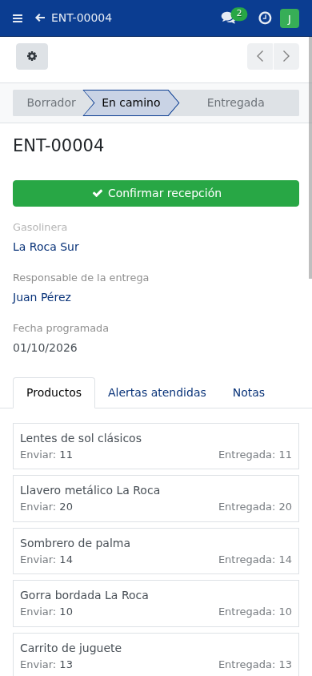

### 2.6 Alertas, ventas y reportes
- **Abastecimiento → Alertas**: alertas de tus gasolineras (solo lectura).
- **Ventas**: tus ventas con fecha, unidades y total (filtro *Hoy*).
- **Reportes → Imprimir reportes**: inventario o productos con poca existencia de tus gasolineras, en PDF.

---

## 3. Administrador

### 3.1 Panel del administrador
Es distinto al del encargado: un **centro de control** de todas las gasolineras (encabezado azul).
- **Accesos rápidos**: *Pedidos por atender*, *Preparar entregas*, *Usuarios* e *Importar desde Excel*.
- **8 indicadores**: **pedidos por atender**, productos con stock bajo, críticos, alertas pendientes,
  entregas en camino, abastecimientos y unidades del mes, y **gasolineras sin actualizar en 7
  días** (sin ventas, entregas ni conteos: conviene llamar al encargado).
- **Dinero**: valor del inventario en gasolineras y en bodega central, lo entregado en el mes y
  lo **vendido este mes**.
- **Pedidos por atender**: la lista de lo que pidieron los encargados.
- **Gráficos**: estado por gasolinera (tocá una barra para ver sus pendientes) y unidades entregadas por mes.
- **Seguimiento de gasolineras**: todas, primero las que más necesitan, con críticos, bajos,
  última actualización y encargado. **Alertas recientes** y **Entregas en camino**.

### 3.2 Pedidos de los encargados
1. **Panel → Pedidos por atender** (o **Abastecimiento → Pedidos**).
2. Abrí el pedido: ves qué pide, cuánto tiene la gasolinera y cuánto hay en bodega.
3. **Aprobar y preparar entrega**: se crea una **entrega en borrador** con lo pedido. Ajustá
   las cantidades si hace falta y pulsá **Confirmar y enviar**. Con **Imprimir hoja** o **Excel**
   descargás la hoja, que dice la gasolinera, el lugar y el **pedido**. El pedido pasa solo a
   *En camino* y a *Entregado* cuando el encargado confirma la recepción.
4. O **Rechazar**, escribiendo el motivo (el encargado lo ve).

Si cancelás la entrega, el pedido vuelve a quedar *Enviado* para atenderlo de nuevo.

### 3.3 Conteos y correcciones de stock
El encargado no corrige el stock a mano: baja con las **ventas** y sube con las **entregas**.
Cuando hay diferencias (rotura, pérdida, error), las corrige el administrador:
- **Conteo rápido**: elegí la gasolinera, escribí en **Contado** la cantidad real de cada producto
  y **Guardar conteo**.
- **Corregir** un solo producto: en Inventario, botón **Corregir** (o **Corregir stock** en el detalle),
  con el motivo.

Todo queda en **Movimientos**.

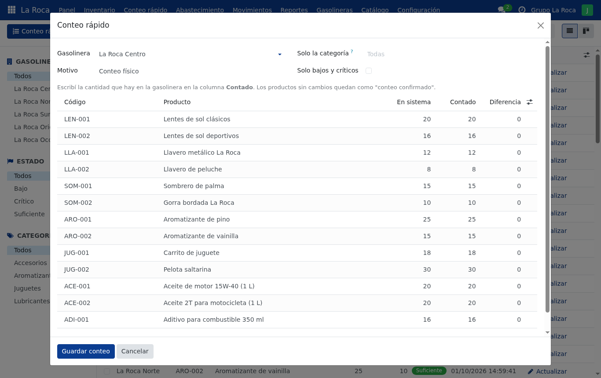

### 3.4 Ventas
**Ventas** muestra las ventas de todas las gasolineras; **Reportes → Análisis de ventas** las
agrupa por día, producto y gasolinera. Para corregir un error: abrir la venta → **Anular venta**
con el motivo; los productos vuelven al inventario.

### 3.5 Alertas
- Se crean **solas** cuando un producto baja del mínimo; suben a **crítico** si empeora y se
  **resuelven solas** al reponer el stock. Si hay una entrega en camino, figuran **En proceso**.
- Llegan al canal **Alertas de abastecimiento** (globo de Conversaciones, arriba a la derecha)
  y **por correo**. Cada mañana a las 7:00 llega un **resumen diario**.

### 3.5.1 Bodega central: panel, recibir mercadería, producto nuevo y contar
**Abastecimiento → Bodega central** (o **Ver bodega** en el panel principal) abre el **panel de la
bodega** (encabezado dorado):
- **Botones**: *Recibir mercadería*, *Producto nuevo*, *Contar bodega*, *Importar desde Excel* y
  *Ver todos los productos*.
- **Números**: productos con stock, unidades, productos **sin stock**, productos que **conviene
  comprar**, lo reservado para entregas en camino y el valor de la bodega.
- **Conviene comprar**: productos donde lo disponible no alcanza para lo que necesitan las
  gasolineras (*Hay disponible*, *Necesitan*, *Faltan*). Cuando llegan, el botón **Ya llegaron:
  recibir estos productos** abre *Recibir mercadería* solo con ellos.
- **Últimas recepciones** de mercadería.

Los encargados ven el panel y la lista (sin botones para modificar ni valores en $).

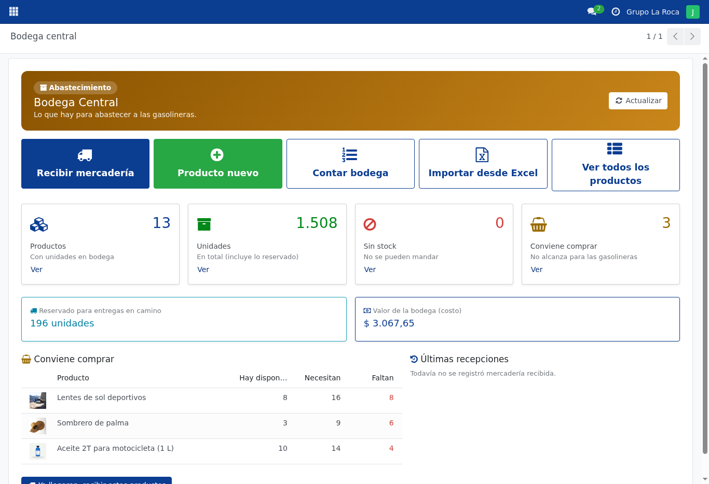

**Producto nuevo** (un producto que nunca tuvieron): nombre, foto, código, categoría, precio,
costo, mínimo y objetivo por gasolinera y las **unidades que llegaron**. Al pulsar **Agregar
producto** queda en el catálogo, en todas las gasolineras y con sus unidades en la bodega.

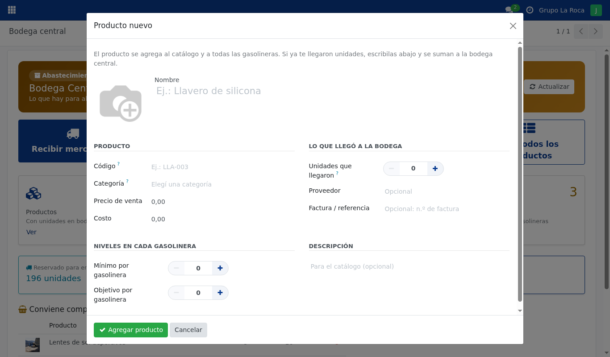

En **Ver todos los productos** se ve cada producto con lo que hay **en bodega**, lo **reservado**,
lo **disponible** y su valor. Solo el administrador la modifica:
- **Recibir mercadería** (cuando te llegan tus productos): con **−** y **+** decís cuántas unidades
  llegaron de cada producto; la columna **Quedará** muestra el total. Opcional: proveedor y
  n.º de factura. **Guardar en la bodega** suma las unidades (queda como recepción en Movimientos).
- **Contar bodega**: escribís la cantidad real que contaste y queda exactamente esa.

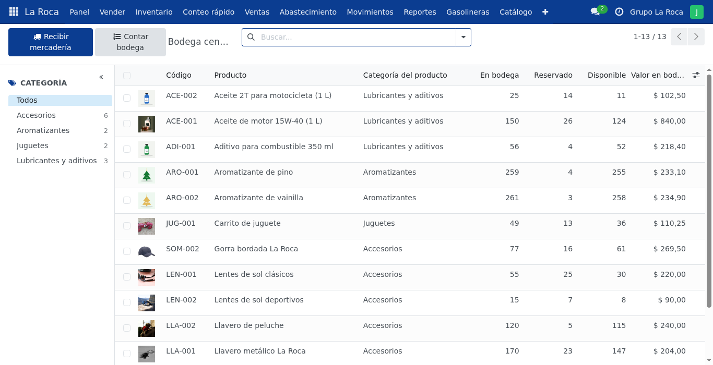

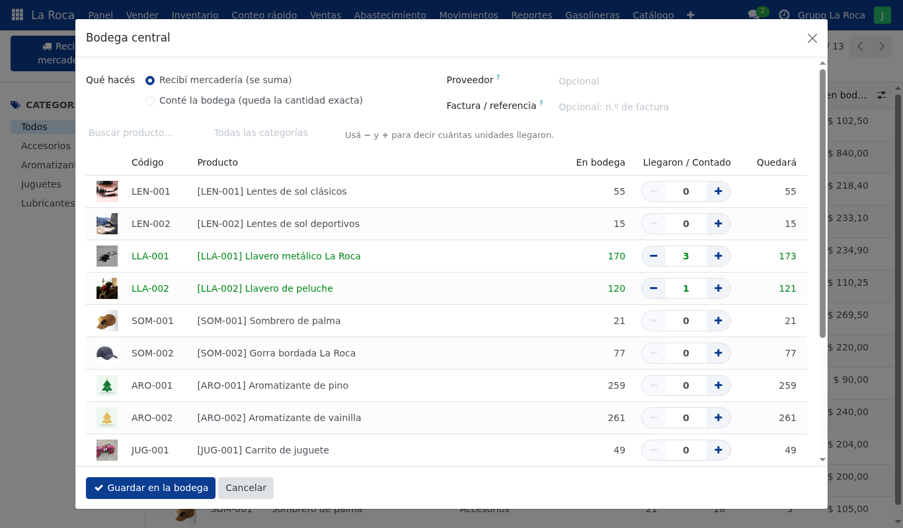

### 3.6 Preparar entrega: tus envíos propios (hoja en PDF o Excel)
Para lo que decidís llevar vos, sin que nadie lo pida (por ejemplo, *"hoy les llevo llaveros
extra"*). Los pedidos de los encargados se atienden desde el pedido (sección 3.2).
1. **Panel → Preparar entrega** (o **Abastecimiento → Preparar entrega**).
2. **¿A dónde va?**: elegí la **gasolinera**; se ven el **lugar** (dirección) y el **encargado**.
3. **¿Cuándo y quién?**: fecha, quién lleva la entrega y notas. **Enviar ahora** (marcado) deja la
   entrega *En camino*, reserva lo de bodega y avisa al encargado; desmarcado, queda en borrador.
4. Agregá los productos con **−** y **+** en **Llevar** (no deja pasar de lo que hay **en bodega**),
   tocá el número **Sugerido** o encendé **Completar con lo sugerido**. Abajo se lee el resumen:
   *"Llevar: 50 Llavero…, 7 Sombrero…"*.
5. **Generar PDF** o **Generar Excel**: se crea la entrega y se descarga la hoja con la
   **gasolinera, el lugar, el teléfono, el encargado** ("Sin pedido") y la tabla de productos con
   casillas para marcar y firmas. También se puede descargar después desde la entrega
   (botones **Imprimir hoja** y **Excel**).

Cada envío propio queda también en **Abastecimiento → Pedidos**, marcado **"Envío del
administrador"** (a la izquierda se filtra por *Origen*), con su lista de productos y su estado
(*En preparación → En camino → Entregado*). El encargado lo ve en **Mis pedidos**.

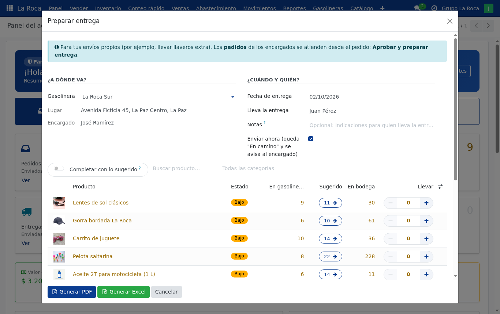

Ejemplos: [PDF](ejemplos_reportes/hoja_de_entrega_con_pedido.pdf) ·
[Excel](ejemplos_reportes/hoja_de_entrega_con_pedido.xlsx).

### 3.6.1 Sugerencias y entregas
1. **Abastecimiento → Sugerencias**: por gasolinera, qué llevar (**Llevar**), lo que ya está en
   otra entrega y lo **disponible en bodega**.
2. Elegir la gasolinera a la izquierda, marcar los productos (la casilla de arriba marca
   todos) → **Crear entrega**. Se crea una entrega en
   **Borrador** por gasolinera. Otra forma: ficha de la gasolinera → **Preparar entrega**.

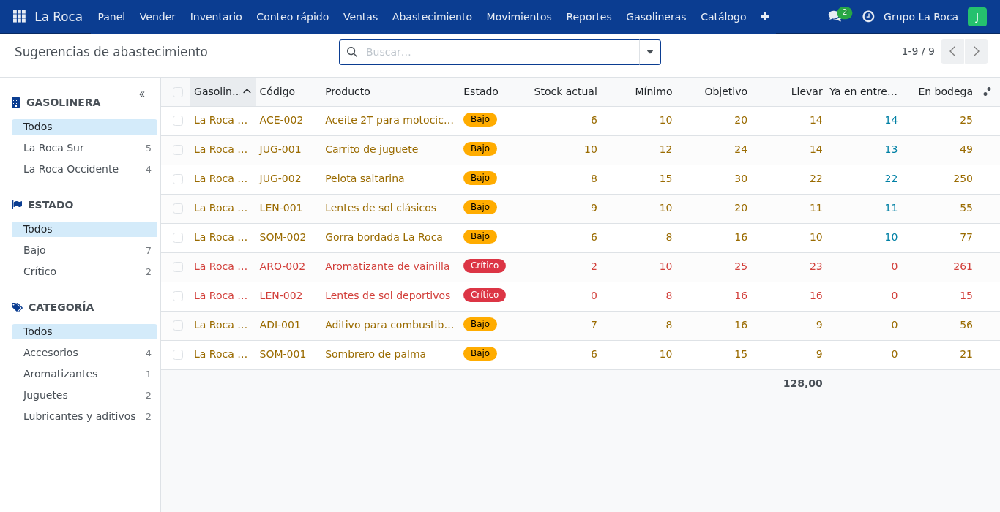

3. En la entrega se pueden ajustar cantidades, responsable, fecha y notas.
4. **Confirmar y enviar**: verifica el stock en bodega, lo **reserva** y avisa al encargado.
5. **Imprimir hoja**: PDF para preparar los productos y firmar la recepción.
6. El encargado (o vos) confirma la **recepción**. Para anular: **Cancelar entrega**.

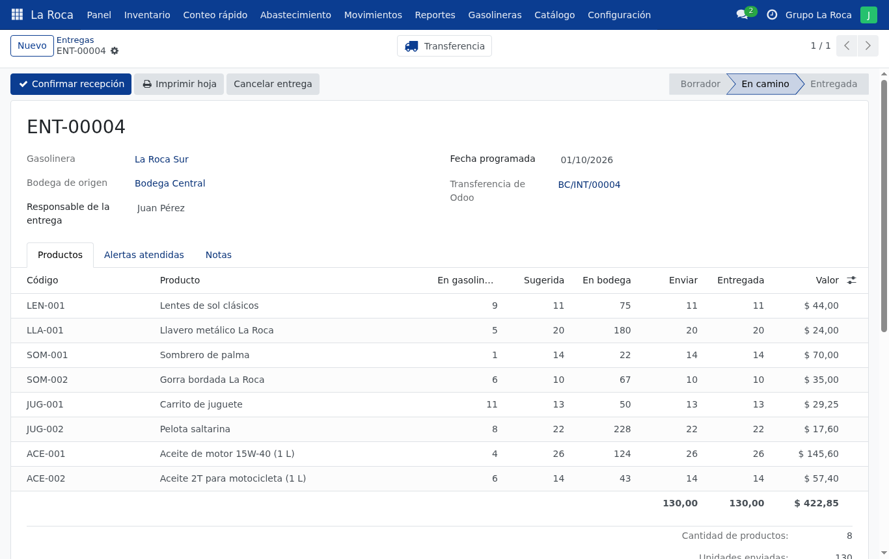

**Historial de abastecimientos**: todo lo entregado, producto por producto, con tabla dinámica.

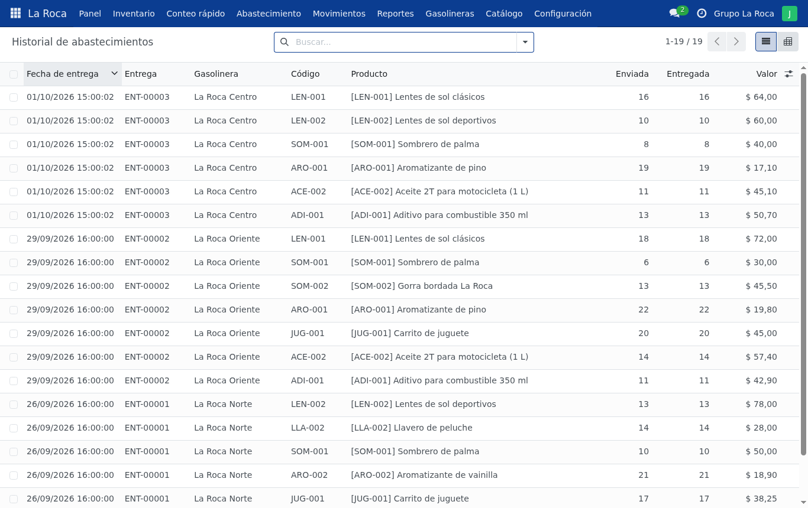

### 3.7 Reportes y análisis
- **Reportes → Imprimir reportes**: *Inventario por gasolinera* (con columna para conteo
  físico y valor), *Productos con poca existencia* (con total a llevar) y
  *Abastecimientos por período*. Ejemplos en `docs/ejemplos_reportes/`.
- **Análisis de inventario / abastecimientos / alertas**: gráficos y tablas dinámicas;
  se puede cambiar el agrupamiento y descargar.
- Cualquier lista se exporta a Excel: seleccionar filas → ⚙ **Acciones → Exportar**.

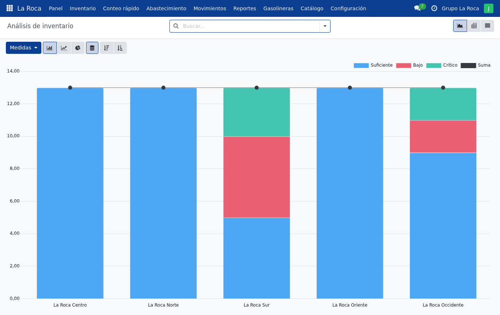

### 3.8 Gasolineras
**Gasolineras → Nuevo**: nombre, código corto (máx. 5 letras), dirección, teléfono y
**encargados**. Al guardar, la gasolinera recibe automáticamente todos los productos del
catálogo con sus mínimos por defecto. La lista muestra críticos, bajos y valor del inventario.

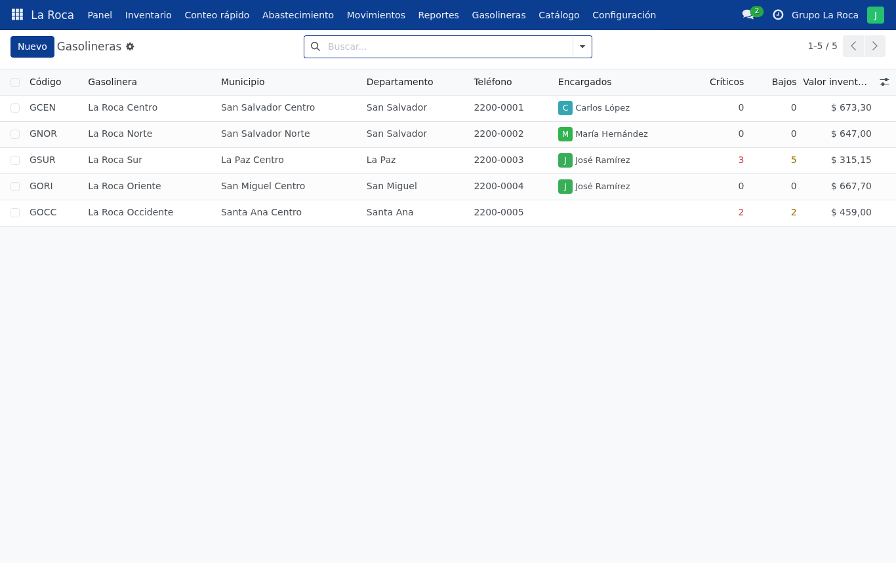

### 3.9 Catálogo de productos
El catálogo muestra cada producto con su **foto, descripción, precio** y cantidad total.
**Catálogo → Productos → Nuevo**: nombre, código, categoría, precio, costo, **foto**
(tocar el recuadro de imagen) y **descripción** (el texto debajo del nombre).
En la pestaña **La Roca**: mínimo y objetivo por defecto, y el botón
**Aplicar a todas las gasolineras**.

### 3.10 Stock mínimo por gasolinera
**Configuración → Stock mínimo por gasolinera**: lista editable. Seleccionando varias filas
se cambia el valor de todas a la vez.
- **Mínimo**: por debajo, el producto queda pendiente de abastecer.
- **Objetivo**: hasta dónde se repone (si es 0, se usa el doble del mínimo).

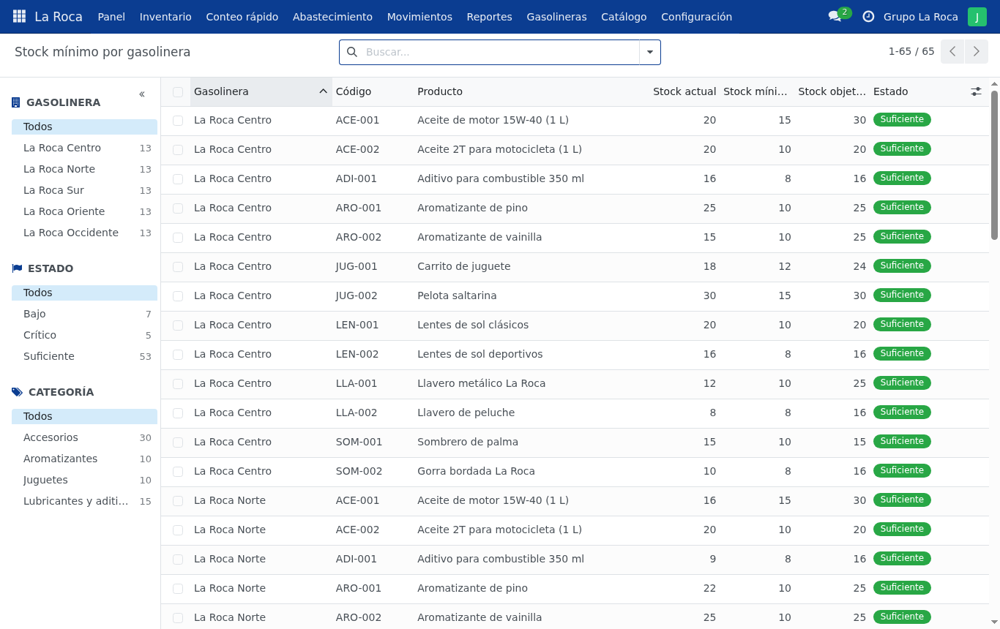

### 3.11 Parámetros
**Configuración → Parámetros**: umbral crítico (% del mínimo), bodega central y envío de
alertas por correo.

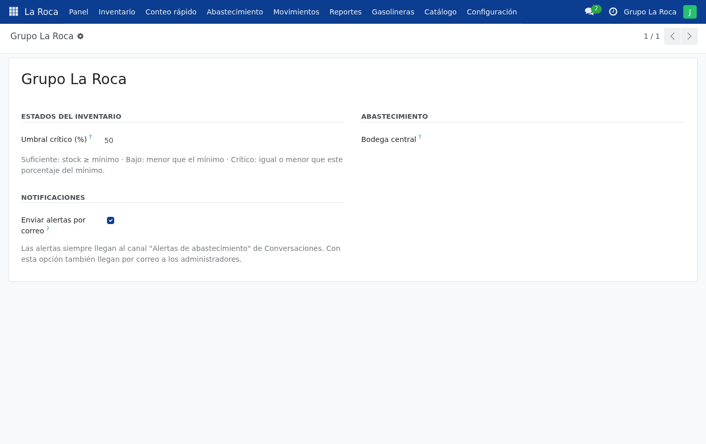

### 3.12 Usuarios (crear, modificar, contraseñas)
Menú **Configuración → Usuarios**. La lista muestra nombre, usuario, rol, gasolineras,
correo y último ingreso. Se puede filtrar por *Encargados*, *Administradores* o *Desactivados*.

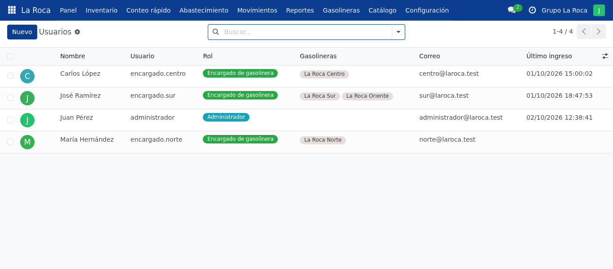

**Crear un usuario** — botón **Nuevo**:
1. **Nombre completo** y, si querés, una foto.
2. **Usuario**: con esto entra al sistema (ej. `encargado.litoral`, sin espacios).
3. **Contraseña** inicial (mínimo 8 caracteres).
4. **Rol**: *Encargado de gasolinera* o *Administrador*.
5. Si es encargado, elegir sus **gasolineras**.
6. Correo y teléfono (opcional; el correo sirve para recibir avisos). **Guardar**.

**Modificar un usuario**: abrirlo y cambiar lo que haga falta (nombre, usuario, rol,
gasolineras, correo, teléfono, foto). Los cambios se aplican de inmediato.

**Cambiar la contraseña** (por ejemplo, si la olvidó): abrir el usuario → **Cambiar contraseña**
→ escribirla dos veces → **Guardar contraseña**. Si tenía la sesión abierta, deberá volver a entrar.

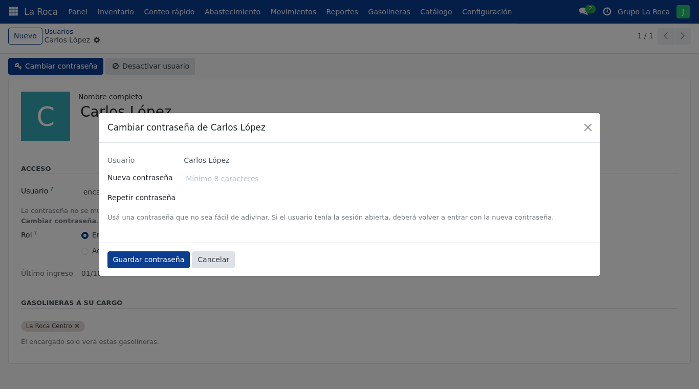

**Desactivar** (por ejemplo, si el empleado ya no trabaja): **Desactivar usuario**. No podrá
entrar, pero su historial se conserva. Se puede **Reactivar** desde el filtro *Desactivados*.

> **Tu propia contraseña** (cualquier usuario): menú de usuario (tu inicial, arriba a la
> derecha) → **Mi perfil** → **Cambiar contraseña**.
>
> Por seguridad, el administrador no puede quitarse su propio rol ni modificar al usuario
> técnico de Odoo (`admin`).

### 3.13 Importar desde Excel
**Configuración → Importar desde Excel**:
1. **Descargar plantilla**: trae los datos actuales en 3 hojas (Productos, Niveles, Existencias).
2. Editarla en Excel y subirla. 3. **Importar**.
Si alguna fila tiene errores no se importa nada y se indica la hoja y la fila a corregir.

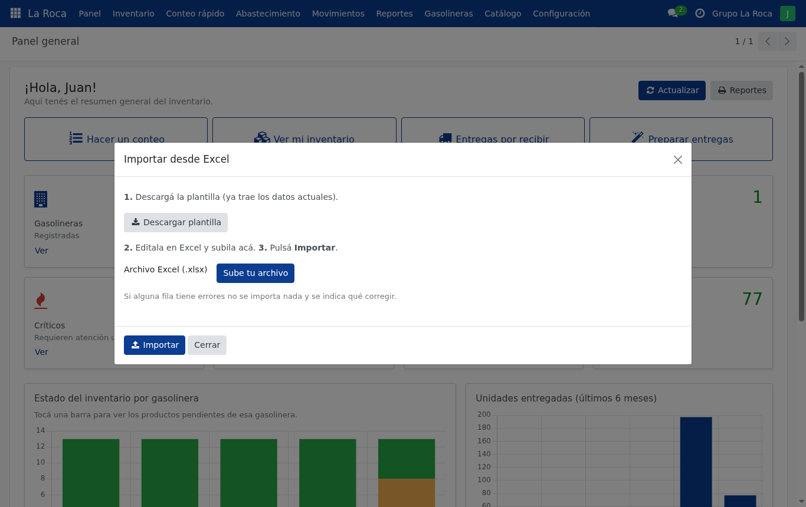

### 3.14 Correo electrónico
En la instalación de prueba los correos van a un buzón local (**http://localhost:8025**,
Mailpit): nada sale a internet. Para usar correo real, el técnico debe configurar el servidor
de correo (ver `DEPLOY.md`).

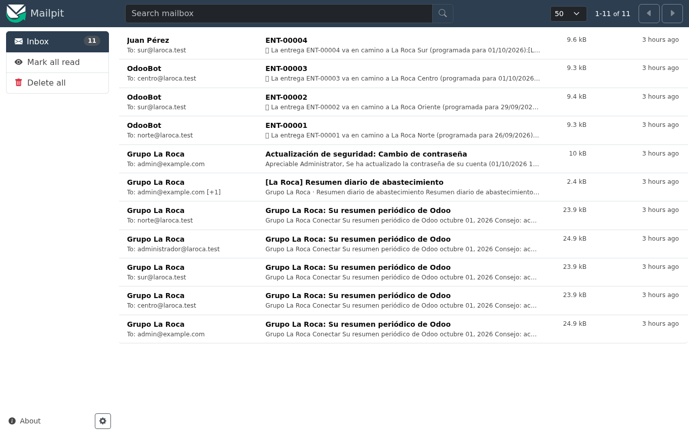

---

## 4. Preguntas frecuentes

| Problema | Solución |
|---|---|
| No veo una gasolinera | El encargado solo ve las asignadas; pedir al administrador que la asigne. |
| El estado dice "Sin mínimo" | El producto no tiene mínimo en esa gasolinera: Configuración → Stock mínimo. |
| No puedo confirmar una entrega | Solo el administrador confirma; el encargado solo confirma la **recepción**. |
| "No hay suficiente stock en Bodega Central" | Bajar la cantidad o registrar primero la mercadería en la bodega. |
| La alerta no se cierra | Se cierra sola cuando el stock llega al mínimo; revisar si la entrega fue parcial. |
| Me equivoqué en una venta | El administrador la anula (Ventas → la venta → *Anular venta*) y el stock vuelve. |
| El stock no coincide con lo que hay | El administrador cuenta y corrige con *Conteo rápido*; queda en Movimientos. |
| Quiero cambiar un pedido enviado | No se puede: hacé otro pedido. Si no lo necesitás, avisale al administrador para que lo rechace. |
