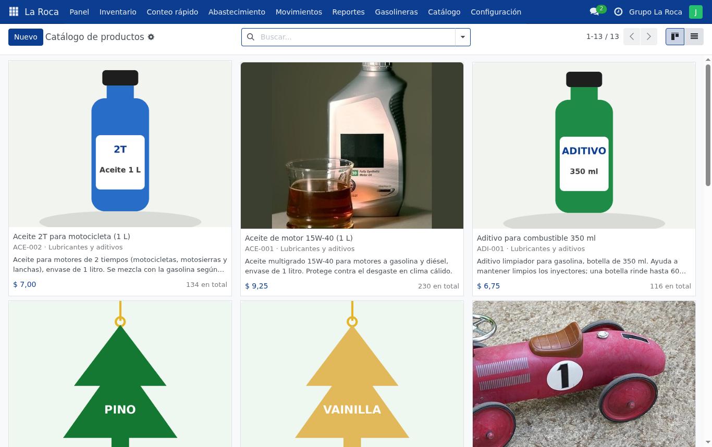
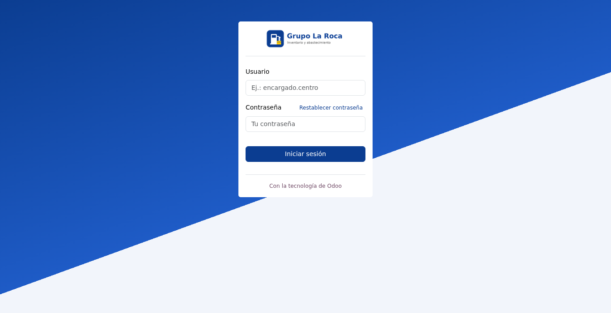
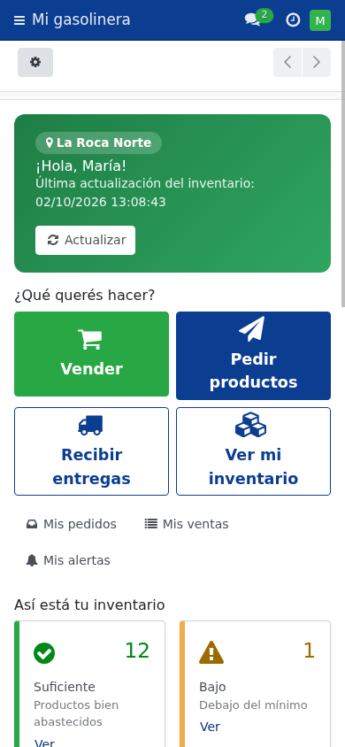

# Mejoras — Más fácil de usar y más completo

> **En pocas palabras:** después de las 4 etapas se agregaron funciones para ahorrar tiempo
> (conteo rápido, importar desde Excel), información de dinero, correos, gráficos, fotos
> reales en el catálogo y un diseño más claro con los colores de Grupo La Roca.

## ¿Qué se agregó?

| Mejora | En palabras simples |
|---|---|
| 🛒 **Vender** | El encargado registra lo que vende ("5 llaveros") y el stock baja solo, con el total a cobrar. |
| 📨 **Pedir productos** | Una sola pantalla: el encargado escribe cuánto necesita ("50 llaveros") o toca "Completar con lo sugerido", y **Enviar pedido**. El administrador lo aprueba y se crea la entrega. Un pedido enviado no se modifica. |
| 🏬 **Bodega central** | Panel propio con botones grandes y "Conviene comprar". Todos ven cuánto hay (los encargados, en su inventario y al pedir). El administrador **recibe mercadería**, agrega un **producto nuevo** con sus unidades en un paso, o **cuenta** la bodega. |
| 🚚 **Preparar entrega** | Para los envíos propios del administrador ("llaveros extra"): elige gasolinera, agrega productos con − y + y descarga la hoja en **PDF o Excel** con gasolinera, lugar, encargado y qué llevar. Los pedidos se atienden como antes, desde el pedido. |
| ➕ **Contador − / +** | Todas las cantidades tienen botones para sumar o restar. Al vender se ve **cuánto queda** en tiempo real y avisa **"¡Ya no hay más!"**; al pedir, el sugerido se copia con un toque o con el interruptor. |
| ✅ **Alertas grandes** | Al estilo "SweetAlert": "¡Tu pedido se realizó!", "¡Venta registrada!" y, en rojo, "Stock insuficiente" si se quiere vender más de lo que hay. |
| ✍️ **Conteo rápido** | El administrador cuenta y corrige todos los productos de una gasolinera en una sola pantalla. |
| 💲 **Valor del inventario** | Cuánto dinero hay en mercadería en cada gasolinera y en la bodega, y cuánto se entregó. |
| 🛍️ **Catálogo con fotos reales y descripciones** | Fotos con licencia libre (con sus autores en [Créditos de imágenes](CREDITOS_IMAGENES.md)) y una descripción de cada producto. |
| 📥 **Importar desde Excel** | Se descarga una plantilla, se llena y se sube. Si hay errores, avisa en qué fila. |
| 📧 **Avisos por correo** | Las alertas y el resumen diario llegan por email (por ahora a un buzón de prueba). |
| 📊 **Gráficos en el panel** | Estado de cada gasolinera y entregas por mes. |
| 🎨 **Diseño más amigable** | Colores de La Roca, accesos rápidos grandes, tarjetas con borde de color según el estado, pantalla de inicio más clara. |
| 🧭 **Un panel para cada rol** | El administrador ve un **centro de control** de todas las gasolineras; el encargado ve **"Mi gasolinera"**, más simple, con lo que tiene que hacer hoy. |
| 👤 **Gestión de usuarios sencilla** | El administrador crea usuarios, cambia contraseñas, rol, gasolineras y datos, y desactiva cuentas, todo desde una pantalla simple. |
| 📖 **Manual y guion del video** | [Manual de usuario](MANUAL_USUARIO.md) con imágenes y [guion del video](GUION_VIDEO.md). |

  
  &nbsp;
  

## ¿Cómo probarlo?
1. **Vender y pedir**: como `encargado.norte`, en el panel tocá **Vender** (escribí 5 en un
   producto → **Registrar venta**) y después **Pedir productos** → **Enviar pedido**. Como
   `administrador`, **Pedidos por atender** → **Aprobar y preparar entrega**; para un envío propio,
   **Panel → Preparar entrega** → **Generar PDF**.
2. **Catálogo**: menú **Catálogo → Productos**.
3. **Valor**: como `administrador`, mirá las tarjetas verdes del panel.
4. **Excel**: **Configuración → Importar desde Excel → Descargar plantilla**.
5. **Correo**: generá una alerta y abrí <http://localhost:8025>.
6. **Paneles distintos**: entrá como `administrador` y después como `encargado.sur`, y compará el menú **Panel**.

## Revisión de pantallas: qué encontramos y arreglamos
Revisamos cada pantalla en computadora y en celular, y corregimos:
- El encargado **no podía abrir una entrega** (error de permisos) → corregido.
- En el celular **no se veía el botón "Confirmar recepción"** → ahora hay un botón verde grande.
- El panel bajaba solo hasta el final de la página → corregido.
- Las cantidades salían con decimales ("20,00") → ahora "20".
- En el login decía "Correo electrónico" aunque se usa un usuario → ahora dice "Usuario".

## ¿Qué comprobamos?
- **78 pruebas automáticas, todas correctas** (contando las de usuarios, paneles, ventas y pedidos).
- Instalación desde cero y recorrido de 23 pantallas sin errores (imágenes en [capturas](capturas/)).

## ¿Qué falta?
- **Correo real** cuando se publique en internet.
- **Fotos propias** de la empresa: reemplazan a las de ejemplo desde la ficha de cada producto.
- Publicarlo en internet y grabar el video (se hará al final).

---

## Anexo técnico (para el equipo de desarrollo)

> Esta parte usa términos técnicos: es para quien programa o explica el código en la defensa.
> Se escribió durante la etapa; algunos pendientes que figuran aquí ya se resolvieron
> (ver "Actualizaciones posteriores" y [Mejoras](MEJORAS.md)).

**Fecha:** 1 de octubre de 2026 · **Estado:** listas para revisión del equipo.
Mejoras elegidas por el equipo (las 8 propuestas). El despliegue en la nube queda para el final.

| # | Mejora | Dónde está | Cómo probarla |
|---|---|---|---|
| 1 | **Conteo rápido**: actualizar todos los productos de una gasolinera en una pantalla | `wizard/conteo.py`, `wizard/conteo_views.xml`; lógica común en `laroca_inventario._ajustar_existencias` | Menú **Conteo rápido** o botón en Inventario |
| 2 | **Valor del inventario ($)** por línea, gasolinera, entrega y en el panel; columnas de valor en reportes | `models/laroca_inventario.py` (`valor_stock`), `laroca_entrega.py` (`costo_unitario`, `valor`), `laroca_panel.py` | Panel (administrador), lista de gasolineras, PDF de inventario |
| 3 | **Fotos de productos** (ilustraciones propias generadas con Python, sin imágenes de terceros) | `laroca_datos_prueba/static/img/productos/`, `scripts/generar_imagenes_productos.py` | Catálogo, inventario en el teléfono |
| 4 | **Importar desde Excel** (plantilla con datos actuales; valida todo antes de importar) | `wizard/importar.py`, `wizard/importar_views.xml` | Configuración → Importar desde Excel |
| 5 | **Avisos por correo** a administradores (alertas y resumen diario) + buzón de prueba **Mailpit** | `models/laroca_alerta.py` (`_enviar_correo_admins`), `docker-compose.yml` (servicio `mailpit`), `laroca_datos_prueba/data/correo.xml` | Generar una alerta y abrir http://localhost:8025 |
| 6 | **Gráficos en el panel** (componente OWL + Chart.js) | `static/src/panel_graficos/` (JS, XML, SCSS), `laroca_panel.get_datos_graficos` | Panel → tocar una barra |
| 7 | **Pulido de pantallas** con revisión visual real (ver abajo) | varias vistas | Ver capturas en `docs/capturas/` |
| 8 | **Manual de usuario y guion del video** | `docs/MANUAL_USUARIO.md`, `docs/GUION_VIDEO.md` | — |

### Pulido de pantallas: qué se encontró y corrigió
La revisión se hizo con un navegador Chromium sin interfaz (en Docker), con capturas en
computadora (1366 px) y teléfono (390 px) para el administrador y un encargado.

| Problema encontrado | Corrección |
|---|---|
| **El encargado no podía abrir una entrega** (error de acceso: el cálculo "disponible en bodega" leía la Bodega Central) | Lectura con permisos del sistema solo para ese dato + prueba automática nueva |
| En el teléfono **no aparecía el botón "Confirmar recepción"** (Odoo oculta la cabecera) | Botón verde visible solo en pantallas chicas |
| Panel: la página bajaba sola hasta el final (Odoo enfoca el primer botón principal) | El botón principal ahora es "Actualizar", arriba |
| Cantidades con decimales ("20,00") | Precisión de unidades a 0 decimales (migración `18.0.6.0.0`) |
| Productos de la entrega cortados en el teléfono | Vista de tarjetas para el teléfono; títulos de columna cortos |
| Sugerencias y Alertas con grupos cerrados | Grupos abiertos por defecto |
| Filas vacías de relleno en las listas del panel | Estilo propio (`panel.scss`) |
| Correo genérico "resumen periódico de Odoo" a todos los usuarios | Desactivado (el sistema tiene su propio resumen) |
| Entregas antiguas con valor $0 | Migración `18.0.5.0.0` completa el costo |

### Migraciones (actualizar sin perder datos)
Al subir la versión del módulo, Odoo ejecuta automáticamente:
- `migrations/18.0.5.0.0/post-migrate.py`: completa el costo de entregas antiguas.
- `migrations/18.0.6.0.0/post-migrate.py`: cantidades sin decimales.

### Pruebas
**56 pruebas automáticas, 0 fallos** (antes 45): conteo rápido, valor del inventario,
gráficos, correo de alertas, importación (completa, con errores, columnas incorrectas,
permisos) y acceso del encargado al formulario de entrega.
Además: instalación desde cero verificada y recorrido visual de 23 pantallas sin errores
de consola (capturas en `docs/capturas/`).

### Pendiente / a decidir
- **Correo real**: para producción hace falta una cuenta SMTP (ver `DEPLOY.md`).
- **Fotos reales** de los productos: reemplazar las ilustraciones cuando la empresa las envíe
  (en la ficha del producto o con la plantilla de importación + imagen manual).
- Gráficos: probados en Chromium; falta probar en Safari del iPhone.
- Despliegue en la nube, GitHub y video (al final, según lo acordado).

### Segunda ronda: diseño amigable, catálogo con fotos reales y documentación sencilla

| Cambio | Dónde está |
|---|---|
| Colores de Grupo La Roca (barra, botones, enlaces) | `static/src/scss/primary_variables.scss` (se carga antes de las variables de Odoo) |
| Login: "Usuario" en vez de "Correo electrónico", fondo y botón con los colores de la marca | `views/login_templates.xml`, `static/src/scss/login.scss` |
| Accesos rápidos en el panel (conteo, inventario, entregas, sugerencias/alertas) | `views/panel_reportes_views.xml`, `laroca_panel.action_conteo / action_ver_sugerencias` |
| Tarjetas de inventario con borde de color según el estado y foto más grande | kanban de `views/laroca_inventario_views.xml`, `static/src/scss/laroca.scss` |
| Catálogo propio con foto grande, descripción y precio | `views/product_views.xml` (`view_laroca_producto_kanban`) |
| Descripción del producto (`description_sale`) en ficha, catálogo y detalle de inventario | `views/abastecimiento_views.xml`, `laroca.inventario.descripcion` |
| 9 fotos reales con licencia libre (Wikimedia Commons / Flickr vía Openverse), recortadas a 600×600 | `laroca_datos_prueba/static/img/productos_fotos/` + `CREDITOS.md`; carga en `_datos_prueba_cargar_imagenes` (`IMAGENES_VERSION = '2'` reemplaza las ilustraciones una sola vez) |
| Descripciones ficticias de los 13 productos | `DESCRIPCIONES` en `laroca_datos_prueba/models/datos_prueba.py` |
| README y documentos de etapa en lenguaje sencillo; detalle técnico en anexos y en `docs/GUIA_TECNICA.md` | `README.md`, `docs/*.md` |

Las capturas de `docs/capturas/` se regeneraron con el diseño nuevo (23 pantallas, sin
errores de consola). Pruebas: 56, todas correctas.

### Tercera ronda: gestión de usuarios por el administrador

| Cambio | Dónde está |
|---|---|
| Rol simplificado `laroca_rol` (Encargado / Administrador) que traduce a grupos de Odoo; al bajar a encargado se quitan también `stock.group_stock_manager` y `base.group_erp_manager` | `models/res_users.py` (`_compute/_inverse/_search_laroca_rol`) |
| Contraseña inicial al crear (`laroca_clave`, mín. 8 caracteres, se guarda cifrada) | `models/res_users.py` |
| Asistente "Cambiar contraseña" con confirmación | `wizard/cambiar_clave.py`, vista en `views/res_users_views.xml` |
| Protecciones: solo el administrador de La Roca gestiona usuarios; no puede modificar usuarios técnicos (`base.group_system`), quitarse su propio rol ni cambiar su propia clave por esta vía (usa *Mi perfil*) | `_laroca_check_puede_gestionar` |
| Pantalla propia (lista, ficha, búsqueda) que oculta a los usuarios técnicos; botón visible en el celular | `views/res_users_views.xml` |
| 7 pruebas nuevas (crear y entrar, cambiar clave, validaciones, cambio de rol, desactivar, protecciones, lista) | `tests/test_usuarios.py` — **63 pruebas en total** |

### Cuarta ronda: un panel distinto para cada rol

| Cambio | Dónde está |
|---|---|
| Dos vistas para el mismo modelo `laroca.panel`: `view_laroca_panel_form` (administrador) y `view_laroca_panel_encargado_form` (encargado). `action_abrir_panel` elige la vista y el título ("Panel del administrador" / "Mi gasolinera") según el grupo | `models/laroca_panel.py`, `views/panel_reportes_views.xml` |
| Administrador: accesos a preparar entregas, entregas, usuarios e importación; 8 indicadores (nuevo: gasolineras **sin actualizar en 7 días**); valores en $; **seguimiento de gasolineras** con última actualización y encargado; **alertas recientes** | campos `gasolinera_seguimiento_ids`, `alerta_reciente_ids`, `kpi_sin_conteo`; `stock.warehouse.laroca_ultimo_conteo` |
| Encargado: encabezado con su(s) gasolinera(s) y la última actualización; 4 botones grandes; tarjetas suficiente / bajo / crítico / por recibir; lista **"Productos que se están acabando"** con foto; entregas por recibir con instrucciones; gráfico de dona | campos `nombre_gasolineras`, `ultimo_conteo`, `kpi_suficientes`, `kpi_bajos`, `producto_pendiente_ids` |
| El gráfico recibe `modo="admin"` o `modo="encargado"` (barras por gasolinera o dona por estado; clic abre los productos filtrados) | `static/src/panel_graficos/` |
| Encabezados de color (azul administrador, verde encargado) y botones grandes | `static/src/panel_graficos/panel.scss`, `static/src/scss/laroca.scss` |
| 3 pruebas nuevas (vista según el rol, datos propios del encargado, seguimiento del administrador) | `tests/test_panel_reportes.py` — **66 pruebas en total** |

Nota técnica: al crear el panel, Odoo deja en caché las listas calculadas vacías; se
invalida el registro en `action_abrir_panel` para que se calculen al leerlas (solo afectaba
cuando se crea y se lee en la misma transacción, como en las pruebas).

### Quinta ronda: ventas, pedidos y el encargado ya no corrige el stock

| Cambio | Dónde está |
|---|---|
| **Pedidos** `laroca.pedido` (+ líneas): borrador → enviado → en preparación → en camino → entregado, o rechazado con motivo. Enviado = bloqueado (`write`/`unlink` de pedido y líneas solo en borrador; los cambios de estado usan `sudo`). "Agregar lo que se está acabando" usa la cantidad sugerida. Aviso al canal y correo a los administradores; mensajes al encargado al aprobar/rechazar | `models/laroca_pedido.py`, `views/pedido_views.xml`, `wizard/pedido_rechazo.py` |
| Aprobar crea una `laroca.entrega` en borrador con `pedido_id`; la entrega actualiza el pedido al confirmarse, recibirse o cancelarse (cancelada → el pedido vuelve a *Enviado*) | `models/laroca_entrega.py` (`_entrega_actualizada`) |
| **Ventas** `laroca.venta` (+ líneas, precio del catálogo fijo): se registran desde la pantalla **Vender** (`laroca.vender`, con búsqueda, categoría, total y tarjetas para el celular). Cada venta es una salida nativa `stock.picking` gasolinera → clientes validada al instante; no se vende más de lo disponible; no se borra ni se edita; el administrador la **anula** con una devolución nativa | `models/laroca_venta.py`, `wizard/vender.py`, `views/venta_views.xml` |
| El encargado **no corrige existencias**: `_ajustar_existencias` exige ser administrador; conteo rápido y "Corregir" solo para el administrador (permisos, menú y botones) | `models/laroca_inventario.py`, `security/ir.model.access.csv`, `views/` |
| Reglas por gasolinera para pedidos y ventas; secuencias PED- y VEN- | `security/laroca_security.xml`, `data/laroca_alertas_data.xml` |
| Paneles: encargado con **Vender** / **Pedir productos**, "vendido hoy", "Pedir estos productos" y "Mis pedidos"; administrador con **pedidos por atender** y **vendido este mes** | `models/laroca_panel.py`, `views/panel_reportes_views.xml` |
| Reportes → **Análisis de ventas** (gráfico, tabla dinámica, lista) | `views/venta_views.xml` |
| Datos ficticios: 6 ventas de los últimos días y 2 pedidos (Sur pide 50 llaveros; Norte ya recibió el suyo) | `laroca_datos_prueba/models/datos_prueba.py` |
| 10 pruebas nuevas (vender y descontar, no vender de más, solo su gasolinera, anular, pedido hasta la entrega, pedido bloqueado, rechazo y permisos, entrega cancelada, faltantes y panel, encargado sin conteo); pruebas viejas adaptadas al administrador | `tests/test_ventas_pedidos.py`, `tests/test_conteo.py`, `tests/test_inventario.py` — **76 pruebas en total** |

Encontrado por las pruebas y corregido: la verificación "solo vende en su gasolinera" se hacía
con los permisos con que llegaba la gasolinera; ahora se hace siempre con los de quien vende.

### Sexta ronda: alertas estilo SweetAlert y pedido rápido

| Cambio | Dónde está |
|---|---|
| Alerta grande con ícono animado (éxito, error, aviso, información), hecha con OWL y el `Dialog` de Odoo (sin librerías externas). Se abre devolviendo la acción cliente `laroca_alerta`; con `next` cierra antes el asistente. En el celular se ve como tarjeta centrada | `static/src/alerta/`, `utils.py` (`accion_alerta`) |
| Vender: stock insuficiente → alerta roja con el detalle, sin cerrar la pantalla (antes era un error de Odoo); venta correcta → "¡Venta registrada!" con número, unidades, total y lo que se está acabando. `laroca.venta._faltantes` se usa en la pantalla y en `_registrar` | `wizard/vender.py`, `models/laroca_venta.py` |
| Pedido rápido `laroca.pedir`: todos los productos (primero los que más faltan), "Completar con lo sugerido", comentario y **Enviar pedido** (crea y envía en un paso) → "¡Tu pedido se realizó!". "Pedir estos productos" del panel lo abre con lo sugerido ya escrito. La lista de pedidos ya no crea borradores a mano | `wizard/pedir.py`, `views/pedido_views.xml`, `models/laroca_panel.py` |
| Corregido (lo encontró la prueba en pantalla del celular): las tarjetas no enviaban la línea de inventario al guardar ("falta un campo obligatorio") y "Hay" quedaba en 0 tras una alerta | `views/venta_views.xml`, `views/pedido_views.xml` |
| Pruebas: venta con stock insuficiente (alerta, sin venta), pedido rápido (pedido enviado, alerta, vacío → aviso), "Pedir estos productos" con lo sugerido | `tests/test_ventas_pedidos.py` — **77 pruebas en total** |

### Séptima ronda: contador − / +, "quedan" en tiempo real y sugerido instantáneo

| Cambio | Dónde está |
|---|---|
| Widget `laroca_contador` (hereda el campo numérico de Odoo): botones − y +, no baja de 0; opción `maximo` (no pasa de otro campo y avisa "¡Ya no hay más!"); opción `siempre` para mostrarlo en todos los renglones de las pantallas rápidas (Odoo deja "solo lectura" los renglones que no se están editando). Usado en vender, pedir, pedido, entrega, recepción, conteo, corregir stock, mínimos y producto | `static/src/contador/`, vistas |
| Widget `laroca_usar_sugerido`: el número sugerido es un botón que copia la cantidad en "Pido" | `static/src/contador/`, `views/pedido_views.xml` |
| "Completar con lo sugerido" pasa a ser un interruptor con `onchange` (llena y vacía al instante, sin recargar). Se usa `autosave: false`: el interruptor de Odoo guarda al tocarlo y en ese caso **no ejecuta el onchange** (por eso no se llenaba nada) | `wizard/pedir.py`, `views/pedido_views.xml` |
| Vender: columnas **Quedan** y aviso ("¡Ya no hay más!", "No alcanza: solo hay N") calculadas al escribir | `wizard/vender.py` (`_compute_quedan`), `views/venta_views.xml` |
| Prueba nueva del interruptor y de "quedan"/aviso | `tests/test_ventas_pedidos.py` — **78 pruebas en total** |

### Octava ronda: contador uniforme y alerta al escribir de más

| Cambio | Dónde está |
|---|---|
| El "+" quedaba escondido en pantallas angostas (~1000 px): la columna medía 90 px y el contador 125 px. Ahora el contador tiene **el mismo tamaño en todas partes** (8,5 rem; más grande en el celular), las columnas con contador miden 150 px y las demás columnas chicas tienen ancho fijo; números centrados y renglones alineados | `static/src/contador/contador.scss`, vistas (`width=`) |
| Al **escribir** (o sumar con +) más de lo que hay aparece la alerta grande **"¡No hay más stock!"** y la cantidad queda en el máximo disponible (`parse` del widget) | `static/src/contador/contador.js` |

Verificado en pantalla a 1000 px, 1366 px y en el celular; 78 pruebas correctas.

### Novena ronda: filtros simples

| Cambio | Dónde está |
|---|---|
| Al tocar un filtro ya no se abre el editor de condiciones de Odoo ("Modificar condición"); se ocultan "Agregar filtro personalizado", "Agrupar por" personalizado y Favoritos. El usuario técnico `admin` y el modo desarrollador conservan todo | `static/src/busqueda_simple/` (parche de `SearchBar` y `SearchBarMenu`) |
| Panel izquierdo con **Estado** y **Gasolinera** en Entregas, Pedidos, Ventas y Alertas (como Inventario); se quitaron los filtros por estado del menú y los filtros puestos por defecto, que se cruzaban con el panel | `views/entrega_views.xml`, `views/pedido_views.xml`, `views/venta_views.xml`, `views/abastecimiento_views.xml` |
| Los botones del panel principal ahora eligen la opción del panel izquierdo (`searchpanel_default_estado`) en lugar de agregar un filtro | `models/laroca_panel.py` |
| Alertas abre en "Abierta" | `views/abastecimiento_views.xml` |

78 pruebas correctas; verificado en pantalla que tocar un filtro no abre el editor.

Segunda parte (todas las pantallas):

| Cambio | Dónde está |
|---|---|
| Ninguna pantalla abre con filtros o agrupaciones puestos arriba. Sugerencias deja de agruparse (la gasolinera se elige a la izquierda); "Ver inventario"/"Pendientes" de una gasolinera y "Productos con stock bajo" del panel usan el panel izquierdo o el dominio de la acción | `views/abastecimiento_views.xml`, `models/stock_warehouse.py`, `models/laroca_panel.py` |
| Panel izquierdo también en Historial de abastecimientos, Análisis (inventario, abastecimientos, alertas, ventas; también en gráficos y tablas con `view_types`) y Productos (por categoría) | vistas de búsqueda |
| Movimientos: buscador propio y simple (producto, referencia, gasolinera, Entradas, Salidas, Hoy) en lugar del de Odoo | `views/laroca_inventario_views.xml` |
| Encontrado al verificar: quitar el `context` de una acción en el XML **no lo borra** de una base ya instalada (Odoo solo escribe los campos presentes). Se pone `context` vacío explícito en Sugerencias, Entregas, Pedidos y Ventas | vistas de acciones |

Verificado en pantalla: 8 pantallas sin filtros arriba y con opciones a la izquierda; 78 pruebas correctas.

### Décima ronda: "Preparar entrega" con hoja en PDF o Excel

| Cambio | Dónde está |
|---|---|
| Pantalla `laroca.preparar.entrega` (administrador): gasolinera con lugar y encargado, pedido opcional (carga sus cantidades sin pasar de lo disponible), fecha, responsable, notas, "Enviar ahora", contador con tope en bodega, sugerido tocable e interruptor. **Generar PDF** / **Generar Excel** crean la entrega (y la confirman si "Enviar ahora") y descargan la hoja; si falta stock o no hay productos, alerta grande | `wizard/preparar_entrega.py`, `wizard/preparar_entrega_views.xml` |
| Hoja PDF rediseñada: gasolinera, lugar y teléfono, encargado, pedido (y quién lo hizo), "Llevar: …", tabla con casillas y firmas | `report/entrega_report.xml`, `laroca.entrega._datos_hoja` |
| Hoja en Excel (xlsxwriter, incluido en Odoo) y botón **Excel** en la entrega | `models/laroca_entrega.py` (`action_descargar_excel`) |
| El pedido abre "Preparar entrega" (`action_preparar_entrega`); `_vincular_entrega` lo pasa a "En preparación" y avisa al encargado | `models/laroca_pedido.py` |
| Corregido (lo encontró la prueba con datos reales): "En bodega" sumaba también lo reservado para entregas en camino; ahora es lo **disponible** (existencias − reservado), igual que al confirmar | `models/laroca_inventario.py` (`_compute_disponible_bodega`) |
| 4 pruebas nuevas (PDF con gasolinera/lugar, pedido + Excel, pedido mayor que la bodega, sugerido/vacío/permisos) | `tests/test_preparar_entrega.py` — **82 pruebas en total** |

Ejemplos generados: `docs/ejemplos_reportes/hoja_de_entrega_con_pedido.pdf` y `.xlsx`.

### Undécima ronda: bodega central visible para todos y editable por el administrador

| Cambio | Dónde está |
|---|---|
| Campos de bodega en el producto: en bodega, reservado, disponible y valor (calculados con `sudo` para que los encargados puedan verlos) | `models/product.py` (`_compute_laroca_bodega`) |
| Lista **Bodega central** (todos la ven; botones solo para el administrador) con categorías a la izquierda | `wizard/bodega_movimiento_views.xml` (`view_laroca_bodega_list`, `action_laroca_bodega`) |
| Pantalla **Recibir mercadería / Contar bodega** (`laroca.bodega.movimiento`): contador − / +, columna "Quedará", proveedor y factura. Recibir = entrada nativa proveedores → bodega (`stock.picking` de recepción); Contar = ajuste de inventario nativo. Alerta grande al terminar | `wizard/bodega_movimiento.py` |
| Encargados: columna **En bodega** en su inventario (lista, tarjetas del celular y detalle) y en *Pedir productos* | `views/laroca_inventario_views.xml`, `views/pedido_views.xml`, `wizard/pedir.py` |
| Panel del administrador: acceso **Recibir mercadería** y enlace **Ver bodega** (Importar desde Excel sigue en Configuración) | `views/panel_reportes_views.xml` |
| 3 pruebas nuevas (recibir suma y el encargado lo ve, contar deja la cantidad exacta, reservado/disponible y permisos) | `tests/test_bodega.py` — **85 pruebas en total** |

**Ajuste pedido por el equipo:** los pedidos de los encargados vuelven a atenderse como antes
(**Aprobar y preparar entrega** en el pedido → entrega con lo pedido → Confirmar y enviar; la hoja
muestra el pedido). "Preparar entrega" queda solo para envíos propios del administrador y ya no
pide elegir un pedido (`wizard/preparar_entrega.py`). Pruebas: **86** correctas.

### Duodécima ronda: panel de la bodega central

| Cambio | Dónde está |
|---|---|
| Panel `laroca.panel.bodega` (menú Abastecimiento → Bodega central): botones Recibir mercadería, Producto nuevo, Contar, Importar, Ver todos; indicadores (productos, unidades, sin stock, conviene comprar, reservado, valor); listas "Conviene comprar" y "Últimas recepciones". Encargados: solo lectura | `models/laroca_panel_bodega.py`, `views/bodega_views.xml` |
| "Conviene comprar": por producto, lo sugerido en todas las gasolineras menos lo disponible en bodega (`laroca_sugerido_gasolineras`, `laroca_faltante_bodega`) | `models/product.py` |
| **Producto nuevo** (`laroca.producto.nuevo`): crea el producto (catálogo + todas las gasolineras) y recibe sus unidades en la bodega en un paso; avisa si el código ya existe | `wizard/producto_nuevo.py` |
| La recepción quedó como método reutilizable `_recibir_productos` | `wizard/bodega_movimiento.py` |
| 2 pruebas nuevas (producto nuevo con unidades y código repetido; panel y "conviene comprar") | `tests/test_bodega.py` — **88 pruebas en total** |

**Envíos del administrador en Pedidos:** lo que el administrador manda desde "Preparar entrega"
queda como pedido con origen **"Envío del administrador"** (campo `origen` en `laroca.pedido`),
con su lista de productos y el mismo seguimiento de estados; filtro "Origen" en Pedidos y la hoja
de entrega lo indica. El encargado lo ve en "Mis pedidos".

**Entregado ✓, avisos por correo y cierre de sesión:** botón **Entregado ✓** (recepción rápida de
todo lo enviado) en la entrega, en la lista y en ambos paneles, con "Llegó distinto (corregir)" para
recepciones parciales (`action_marcar_entregada`). Los avisos automáticos salen desde
`notificaciones@<dominio>` aunque el usuario no tenga correo (antes daba "mail_from_missing").
Alerta de confirmación al **cerrar sesión** (`static/src/alerta/`). 89 pruebas correctas.
